# 问题修改清单 · 重新打开 / 待处理（2026-09-09）

本目录只收录企业微信表格「问题修改清单」里状态为 **重新打开** 或 **待处理** 的条目。

来源：[锐涞经销商管理系统开发任务清单和排期计划V2](https://doc.weixin.qq.com/sheet/e3_AXwAFAYYAHoCNd0r367mETBGD1tjM?tab=hoj4ui)（工作表：问题修改清单）

核对时间：2026-09-09。共 **31** 条（重新打开 21、待处理 10）。

**图：已按表格单元格原文件拉取，不是表格里看到的 400px 缩略图。** 表格单元格只是把原图缩小显示；微信 CDN 去掉 `w/h` 参数后字节数不变，即文件本身就是上传原图。建议用浏览器打开 `打开图文.html`（按原始像素显示，可横向滚动）。

与在线表格逐格核对：截图1–3 + 反馈截图1–2，合计 **59** 张，本地 **59** 张，无缺张。

| # | 表格行 | 状态 | 模块 | 原图 | 反馈图 | 像素（宽x高） |
|---|--------|------|------|------|--------|----------------|
| 1 | 3 | 重新打开 | 一级代理/二级代理/待分配 | 1 | 2 | 1920×953；1920×953；1920×953 |
| 2 | 5 | 重新打开 | 二级代理 | 2 | 1 | 1920×953；1920×953；1920×953 |
| 3 | 7 | 待处理 | 二级审核 | 1 | 1 | 1920×953；414×780 |
| 4 | 8 | 重新打开 | 二级审核/待分配/采购单管理 | 1 | 1 | 1920×953；1920×953 |
| 5 | 14 | 重新打开 | SN码库 | 1 | 1 | 1920×953；1920×953 |
| 6 | 15 | 重新打开 | SN码库 | 1 | 1 | 1920×953；1920×953 |
| 7 | 17 | 重新打开 | SN码库 | 1 | 1 | 1920×953；1920×953 |
| 8 | 19 | 重新打开 | SN码库 | 1 | 1 | 3840×953；1920×953 |
| 9 | 22 | 重新打开 | 采购单管理/销售单管理/库存管理/返货管理/异常管理/销售客户 | 1 | 0 | 3725×944 |
| 10 | 26 | 重新打开 | 采购单管理 | 1 | 1 | 1920×953；1920×953 |
| 11 | 46 | 重新打开 | 销售客户 | 1 | 1 | 1920×953；1920×953 |
| 12 | 47 | 重新打开 | 销售客户 | 1 | 2 | 1920×953；1620×272；1920×953 |
| 13 | 52 | 重新打开 | 角色与权限 | 1 | 1 | 1920×953；1920×953 |
| 14 | 55 | 重新打开 | 数据 | 1 | 1 | 806×821；414×780 |
| 15 | 63 | 重新打开 | 业务-采购 | 2 | 1 | 1033×812；402×276；414×780 |
| 16 | 66 | 重新打开 | 业务-销售 | 1 | 1 | 999×810；414×780 |
| 17 | 67 | 重新打开 | 业务-销售 | 1 | 1 | 1045×862；414×780 |
| 18 | 68 | 重新打开 | 业务-C端订单 | 1 | 1 | 1009×749；414×780 |
| 19 | 70 | 重新打开 | 库存-在库SN | 2 | 1 | 1062×824；363×475；414×780 |
| 20 | 71 | 重新打开 | 库存-商品 | 1 | 1 | 1481×834；414×780 |
| 21 | 72 | 重新打开 | 售后 | 1 | 1 | 1478×957；414×780 |
| 22 | 79 | 重新打开 | 异常 | 1 | 1 | 1016×591；414×780 |
| 23 | 83 | 待处理 | SN码库 | 2 | 0 | 1920×953；1920×953 |
| 24 | 84 | 待处理 | 异常管理 | 1 | 0 | 1920×953 |
| 25 | 85 | 待处理 | 扫码 | 1 | 0 | 414×780 |
| 26 | 86 | 待处理 | 异常管理 | 1 | 0 | 1920×953 |
| 27 | 87 | 待处理 | 销售单管理 | 1 | 0 | 1920×953 |
| 28 | 88 | 待处理 | 异常管理 | 1 | 0 | 1546×561 |
| 29 | 89 | 待处理 | 异常管理 | 2 | 0 | 1920×953；1920×953 |
| 30 | 90 | 待处理 | 异常管理 | 1 | 0 | 1920×953 |
| 31 | 92 | 待处理 | 创建代理账号 | 1 | 0 | 1920×953 |

说明：下面几张文件内容相同，是表格里复用了同一张反馈图，不是漏下。

- issue-15-fb-1.png、issue-16-fb-1.png、issue-18-fb-1.png

---

## 1. 一级代理/二级代理/待分配 — 一级代理、二级代理、待分配详情里选择省市的范围需要改成完整的全国的，现在都只有一部分

- 表格行：3
- 反馈日期：9月7日
- 平台：管理端
- 模块：一级代理/二级代理/待分配
- 状态：**重新打开**

**问题描述**

一级代理、二级代理、待分配详情里选择省市的范围需要改成完整的全国的，现在都只有一部分

**反馈描述**

一级代理/二级代理/待分配：围栏城市仅显示可选的城市，不可选的城市不要显示。

**原始截图**

图1（1920×953，原文件，非缩略图）：

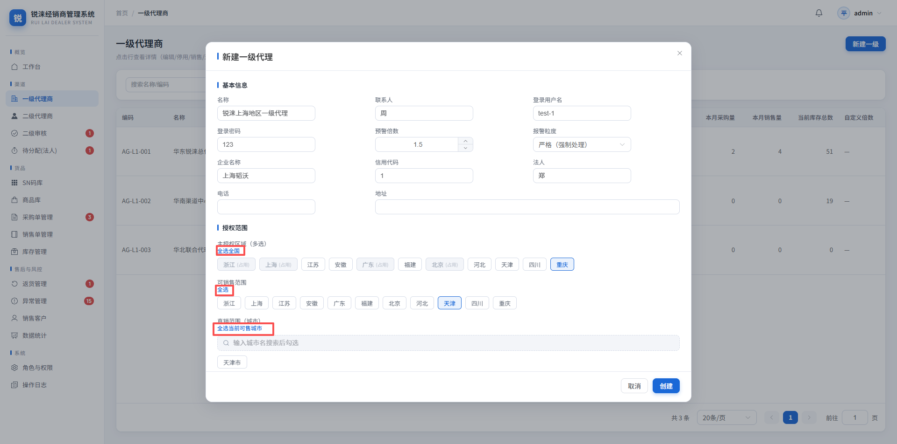

**反馈截图**

图1（1920×953，原文件，非缩略图）：

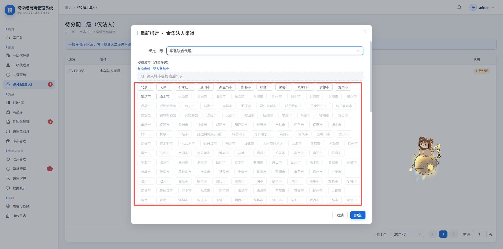

图2（1920×953，原文件，非缩略图）：

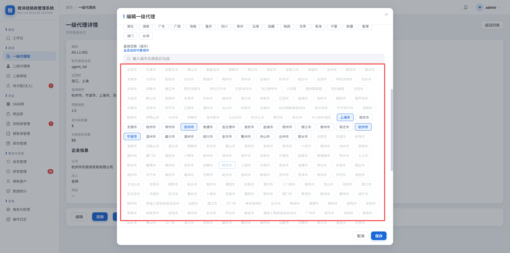

---

## 2. 二级代理 — 二级代理编辑页面样式布局要改成和一级代理一样的

- 表格行：5
- 反馈日期：9月7日
- 平台：管理端
- 模块：二级代理
- 状态：**重新打开**

**问题描述**

二级代理编辑页面样式布局要改成和一级代理一样的

**反馈描述**

企业信息往上挪，放到基本信息下方

**原始截图**

图1（1920×953，原文件，非缩略图）：

图2（1920×953，原文件，非缩略图）：

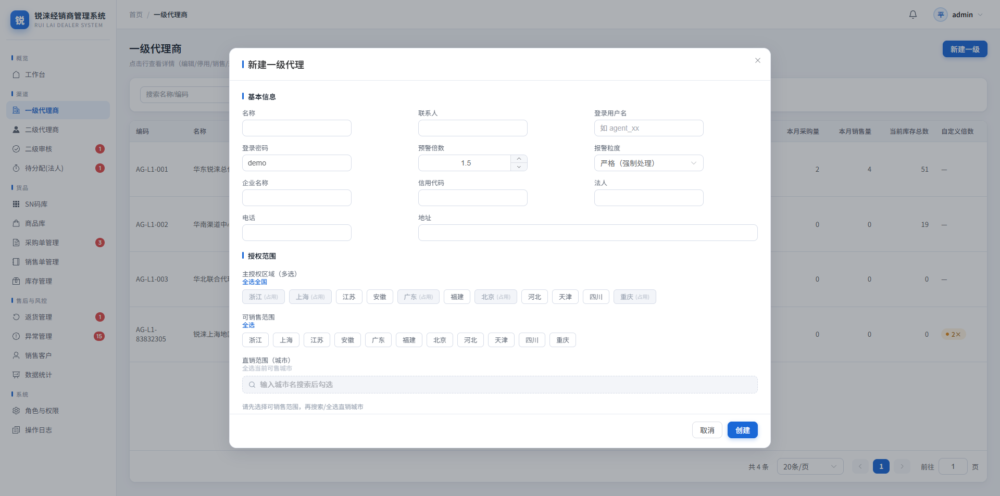

**反馈截图**

图1（1920×953，原文件，非缩略图）：

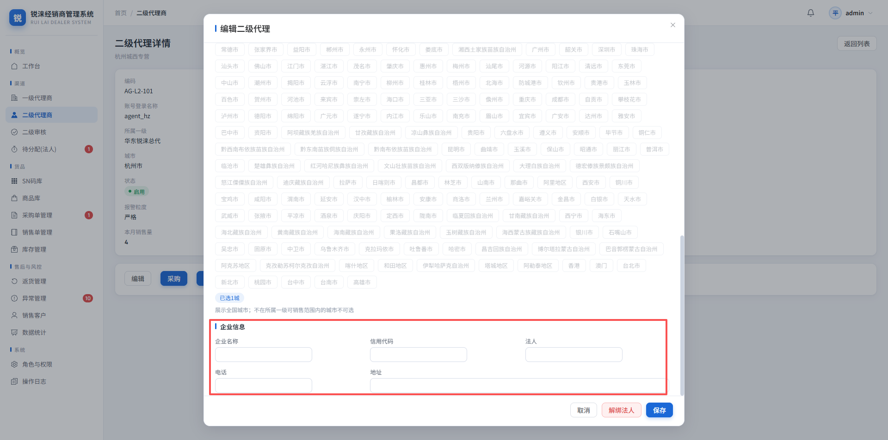

---

## 3. 二级审核 — 弹窗改成横向的，且下面不要留这么多空白。

- 表格行：7
- 反馈日期：9月7日
- 平台：管理端
- 模块：二级审核
- 状态：**待处理**

**问题描述**

弹窗改成横向的，且下面不要留这么多空白。

**反馈描述**

创建二级无法输入导致无法创建待审核的数据，无法测试验证

**原始截图**

图1（1920×953，原文件，非缩略图）：

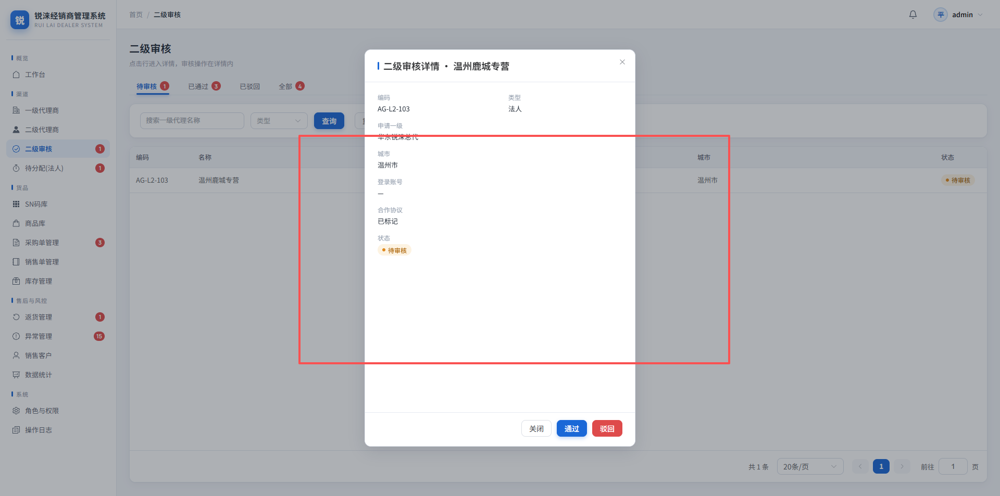

**反馈截图**

图1（414×780，原文件，非缩略图）：

---

## 4. 二级审核/待分配/采购单管理 — 待审核、已通过、已驳回、全部不需要右上角的数字

- 表格行：8
- 反馈日期：9月7日
- 平台：管理端
- 模块：二级审核/待分配/采购单管理
- 状态：**重新打开**

**问题描述**

待审核、已通过、已驳回、全部不需要右上角的数字

**反馈描述**

只有有待处理的需要标数字，其他的不需要标

**原始截图**

图1（1920×953，原文件，非缩略图）：

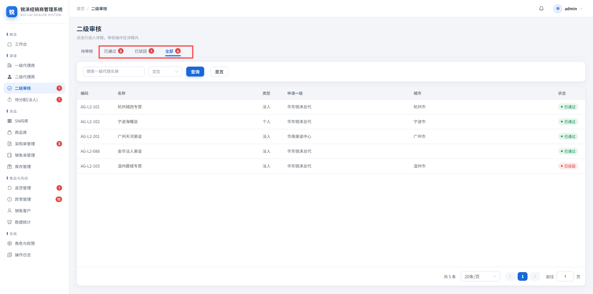

**反馈截图**

图1（1920×953，原文件，非缩略图）：

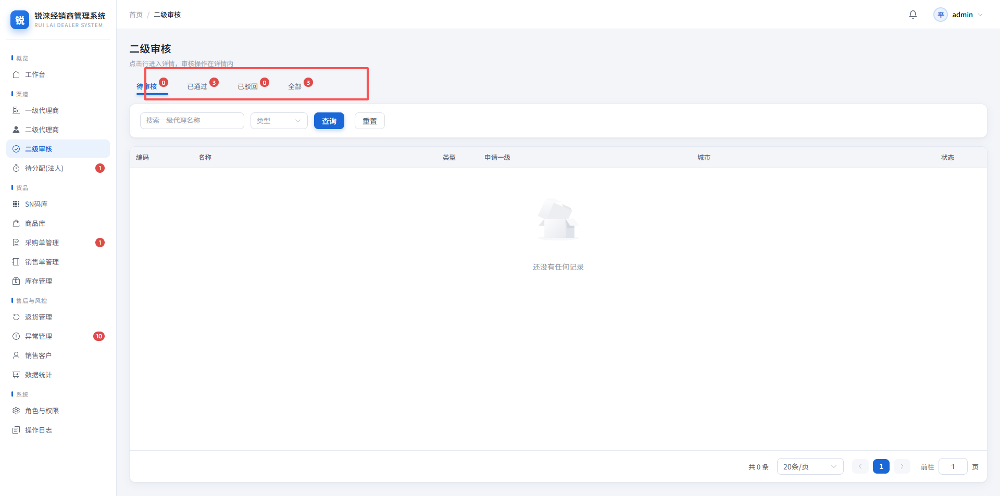

---

## 5. SN码库 — 列宽调整：SN、商品、尺寸列宽太大了，后面几列列宽太小，需要调整平衡一点

- 表格行：14
- 反馈日期：9月7日
- 平台：管理端
- 模块：SN码库
- 状态：**重新打开**

**问题描述**

列宽调整：SN、商品、尺寸列宽太大了，后面几列列宽太小，需要调整平衡一点

**反馈描述**

商品和尺寸中间太宽了，标签后面也空了一大片，别的都很挤

**原始截图**

图1（1920×953，原文件，非缩略图）：

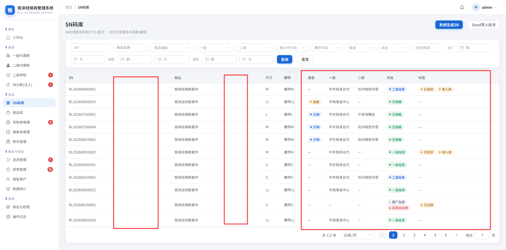

**反馈截图**

图1（1920×953，原文件，非缩略图）：

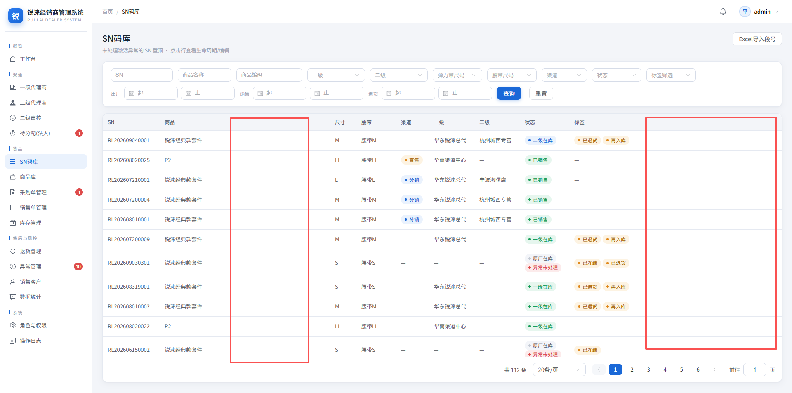

---

## 6. SN码库 — 商品编码改成输入框，搜索的编码，现在下拉框选择的是商品名称

- 表格行：15
- 反馈日期：9月7日
- 平台：管理端
- 模块：SN码库
- 状态：**重新打开**

**问题描述**

商品编码改成输入框，搜索的编码，现在下拉框选择的是商品名称

**反馈描述**

不管输入什么都没有搜索结果

**原始截图**

图1（1920×953，原文件，非缩略图）：

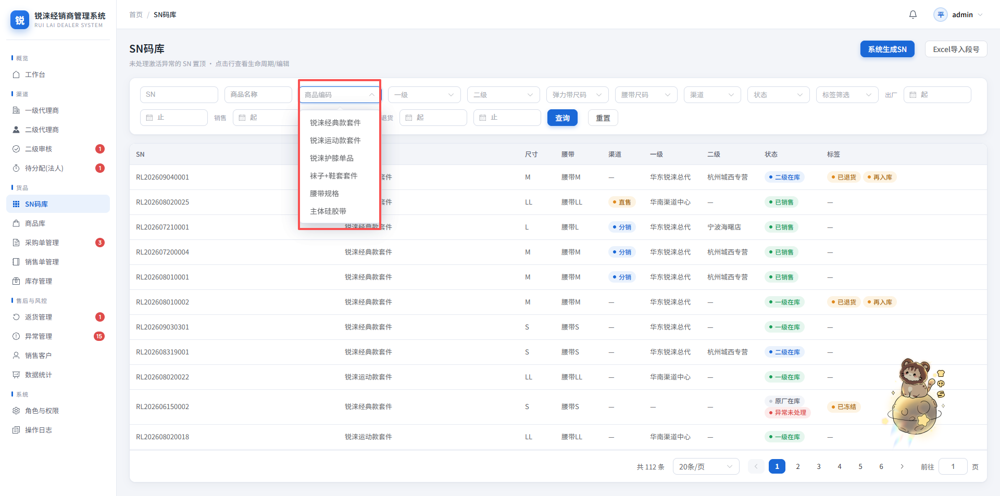

**反馈截图**

图1（1920×953，原文件，非缩略图）：

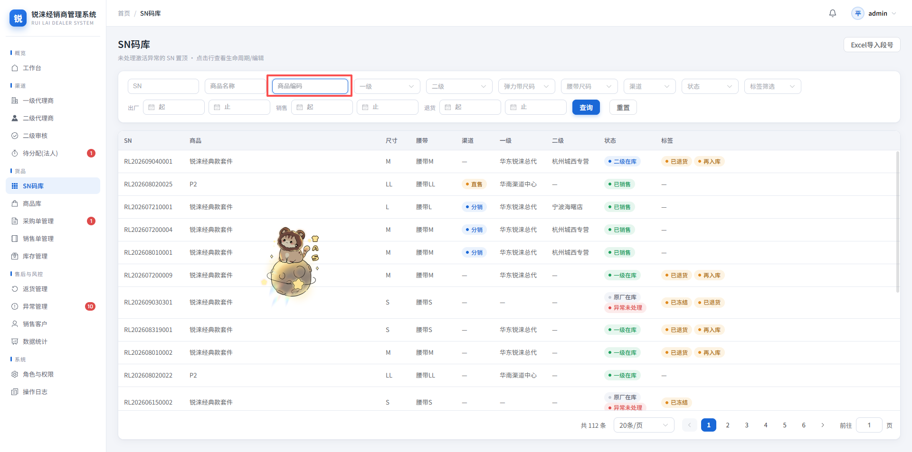

---

## 7. SN码库 — 出厂日期是怎么算的

- 表格行：17
- 反馈日期：9月7日
- 平台：管理端
- 模块：SN码库
- 状态：**重新打开**

**问题描述**

出厂日期是怎么算的

**反馈描述**

日期筛选结果不对

**原始截图**

图1（1920×953，原文件，非缩略图）：

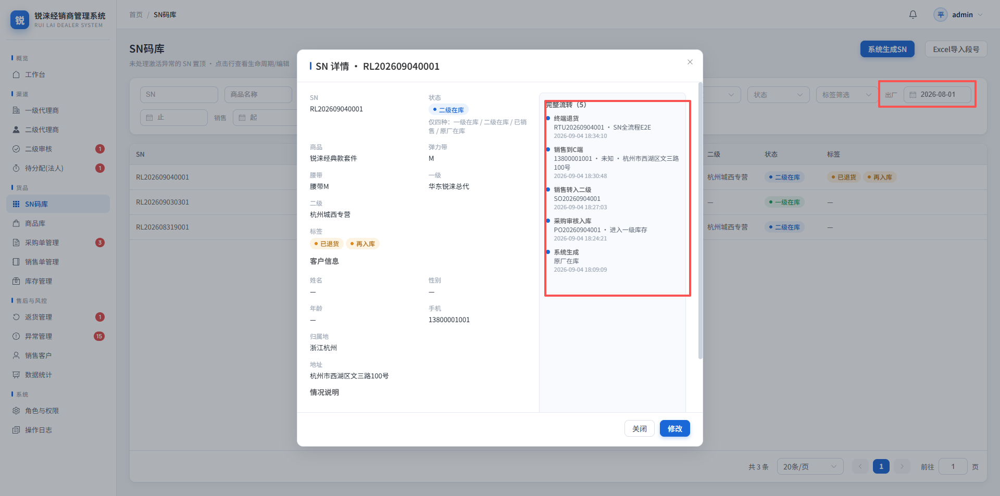

**反馈截图**

图1（1920×953，原文件，非缩略图）：

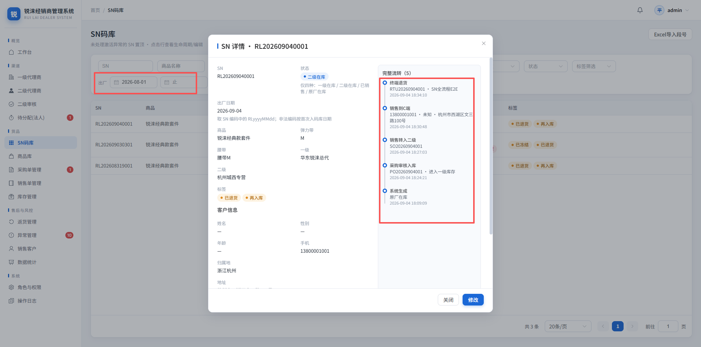

---

## 8. SN码库 — 1、修改页面情况说明和处理说明内容和原型不一致，缺少填写日期

- 表格行：19
- 反馈日期：9月7日
- 平台：管理端
- 模块：SN码库
- 状态：**重新打开**

**问题描述**

1、修改页面情况说明和处理说明内容和原型不一致，缺少填写日期
2、所属二级（调库）不要换行

**反馈描述**

样式错乱，两个框叠一起了

**原始截图**

图1（3840×953，原文件，非缩略图）：

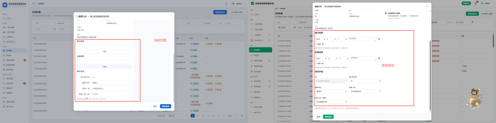

**反馈截图**

图1（1920×953，原文件，非缩略图）：

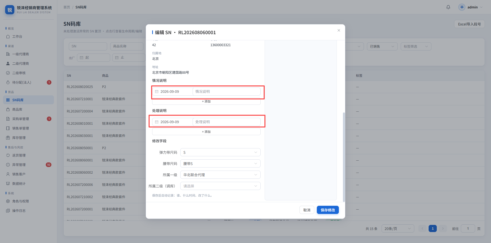

---

## 9. 采购单管理/销售单管理/库存管理/返货管理/异常管理/销售客户 — 筛选和数据汇总区域样式和设计稿不统一

- 表格行：22
- 反馈日期：9月7日
- 平台：管理端
- 模块：采购单管理/销售单管理/库存管理/返货管理/异常管理/销售客户
- 状态：**重新打开**

**问题描述**

筛选和数据汇总区域样式和设计稿不统一

**反馈描述**

（无）

**原始截图**

图1（3725×944，原文件，非缩略图）：

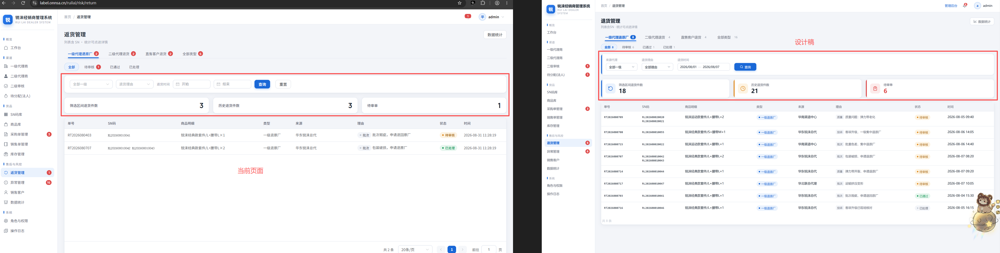

---

## 10. 采购单管理 — 已填写号段显示为10，但是无法确认保存，提示已填0

- 表格行：26
- 反馈日期：9月7日
- 平台：管理端
- 模块：采购单管理
- 状态：**重新打开**

**问题描述**

已填写号段显示为10，但是无法确认保存，提示已填0

**反馈描述**

不需要做判断

**原始截图**

图1（1920×953，原文件，非缩略图）：

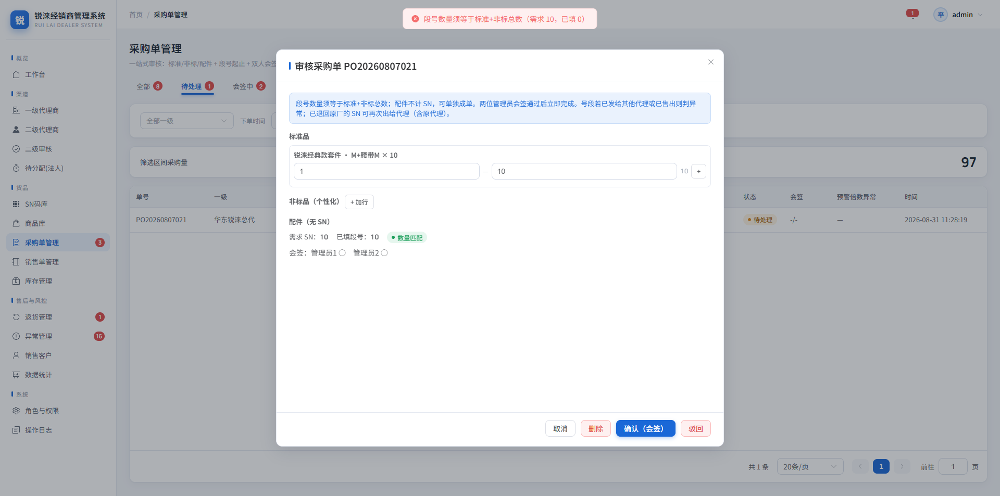

**反馈截图**

图1（1920×953，原文件，非缩略图）：

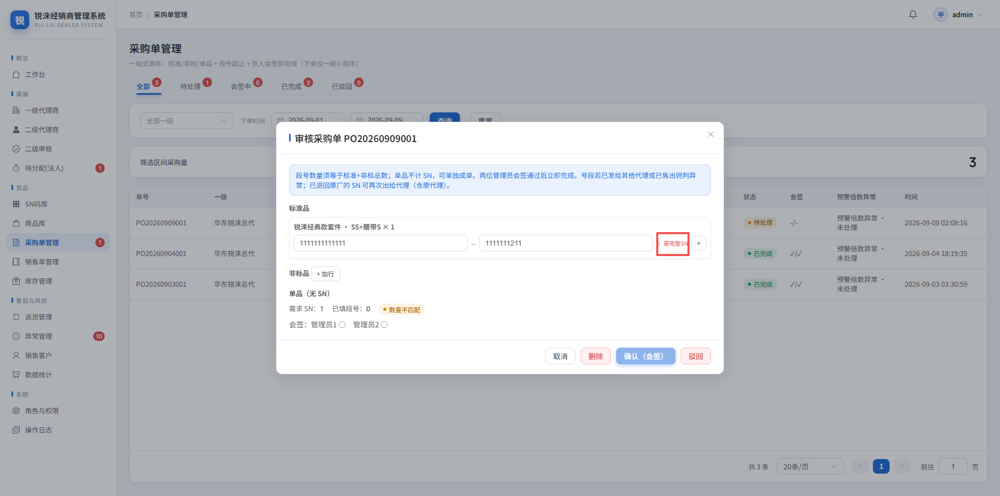

---

## 11. 销售客户 — 时间筛选未生效，只有第一条是9月的，其他都是8月的

- 表格行：46
- 反馈日期：9月7日
- 平台：管理端
- 模块：销售客户
- 状态：**重新打开**

**问题描述**

时间筛选未生效，只有第一条是9月的，其他都是8月的

**反馈描述**

日期筛选结果不对

**原始截图**

图1（1920×953，原文件，非缩略图）：

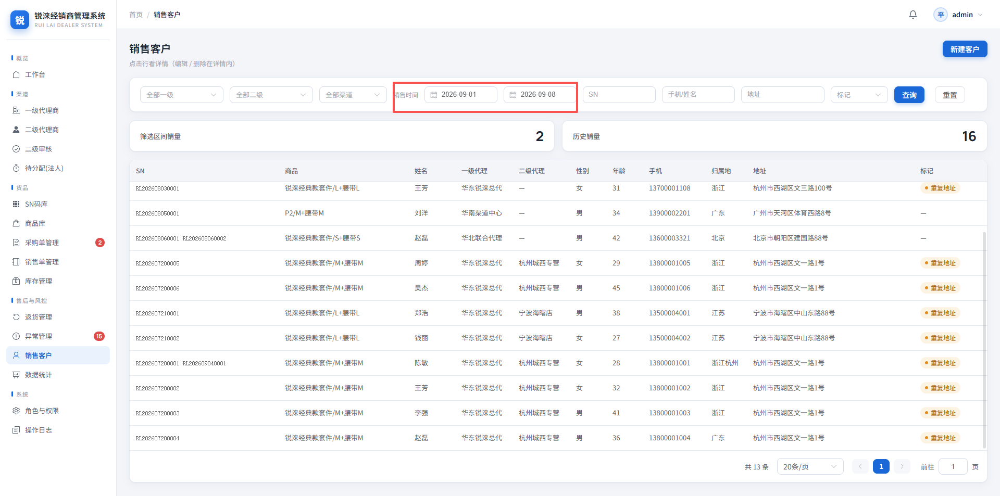

**反馈截图**

图1（1920×953，原文件，非缩略图）：

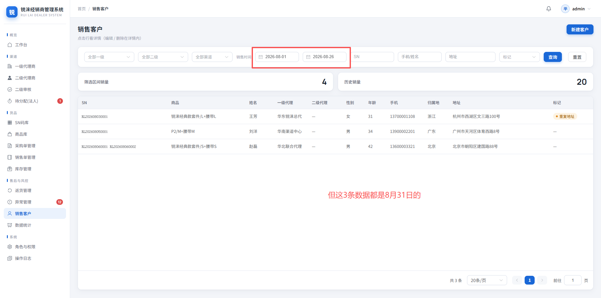

---

## 12. 销售客户 — 1、筛选的标记下拉框应该是重复地址、重复手机号，去掉仅重复

- 表格行：47
- 反馈日期：9月7日
- 平台：管理端
- 模块：销售客户
- 状态：**重新打开**

**问题描述**

1、筛选的标记下拉框应该是重复地址、重复手机号，去掉仅重复
2、因为小程序上无法输入地址，暂时无法验证当手机号也重复时会怎么提示。需要系统自己验证下，正确效果是同时显示重复手机号和重复地址两个标签并列

**反馈描述**

原已有手机号：13800001001
已有地址：天津市天津市和平区天津路11101
然后我激活填写了一个重复手机号且重复地址的，但是只报了异常，销售客户里没有标记重复；
新扫的不要合并到原有的订单里，应该是创建一条新的记录

**原始截图**

图1（1920×953，原文件，非缩略图）：

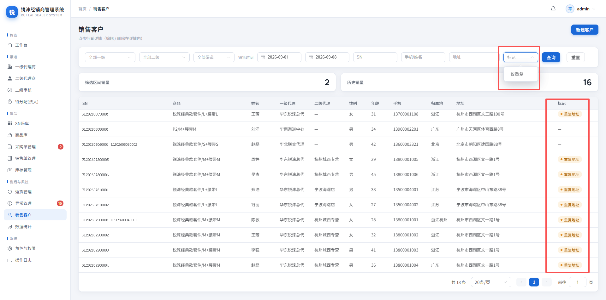

**反馈截图**

图1（1620×272，原文件，非缩略图）：

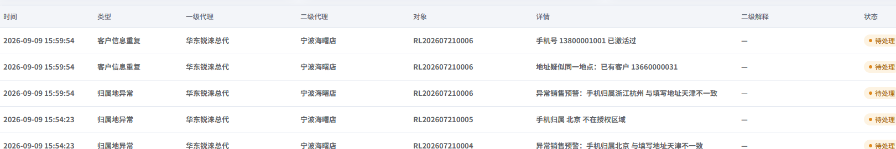

图2（1920×953，原文件，非缩略图）：

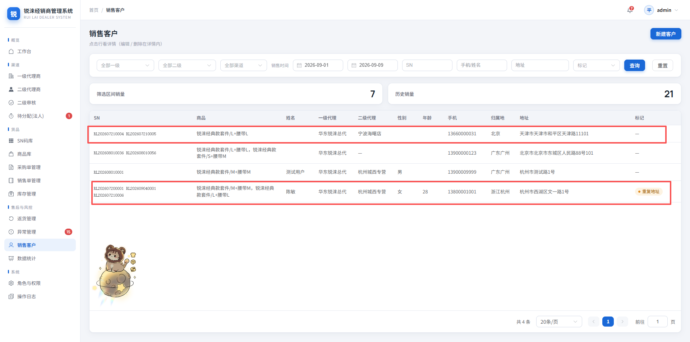

---

## 13. 角色与权限 — 角色操作这里增加删除按钮，可以删除没有绑定过账号的角色

- 表格行：52
- 反馈日期：9月7日
- 平台：管理端
- 模块：角色与权限
- 状态：**重新打开**

**问题描述**

角色操作这里增加删除按钮，可以删除没有绑定过账号的角色

**反馈描述**

没有删除按钮

**原始截图**

图1（1920×953，原文件，非缩略图）：

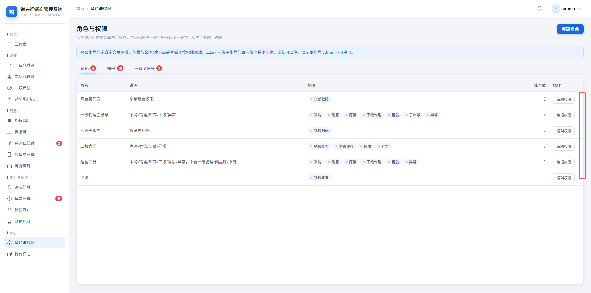

**反馈截图**

图1（1920×953，原文件，非缩略图）：

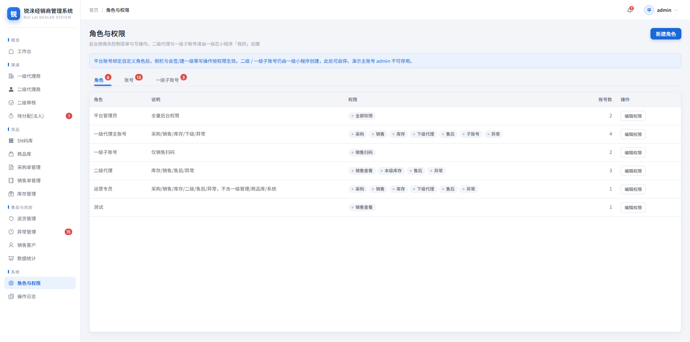

---

## 14. 数据 — 1、日期选择区域样式调整成设计稿那样

- 表格行：55
- 反馈日期：9月7日
- 平台：小程序
- 模块：数据
- 状态：**重新打开**

**问题描述**

1、日期选择区域样式调整成设计稿那样
2、当前在库数放到图表上方
3、下面图表数据用左右切换的，移动端可以左右滑动交互效果

**反馈描述**

页面地下有一大片空白区域去掉

**原始截图**

图1（806×821，原文件，非缩略图）：

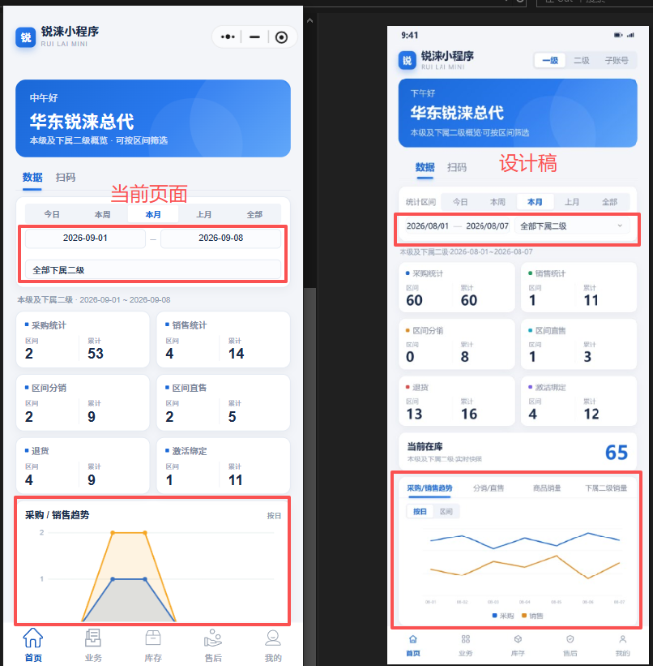

**反馈截图**

图1（414×780，原文件，非缩略图）：

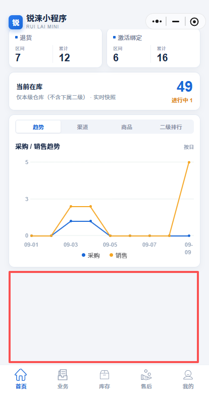

---

## 15. 业务-采购 — 1、详情信息和原型不匹配

- 表格行：63
- 反馈日期：9月7日
- 平台：小程序
- 模块：业务-采购
- 状态：**重新打开**

**问题描述**

1、详情信息和原型不匹配
2、号段不要有代码

**反馈描述**

详情信息和原型不匹配

**原始截图**

图1（1033×812，原文件，非缩略图）：

图2（402×276，原文件，非缩略图）：

**反馈截图**

图1（414×780，原文件，非缩略图）：

---

## 16. 业务-销售 — 详情信息和原型不匹配

- 表格行：66
- 反馈日期：9月7日
- 平台：小程序
- 模块：业务-销售
- 状态：**重新打开**

**问题描述**

详情信息和原型不匹配

**反馈描述**

详情信息和原型不匹配

**原始截图**

图1（999×810，原文件，非缩略图）：

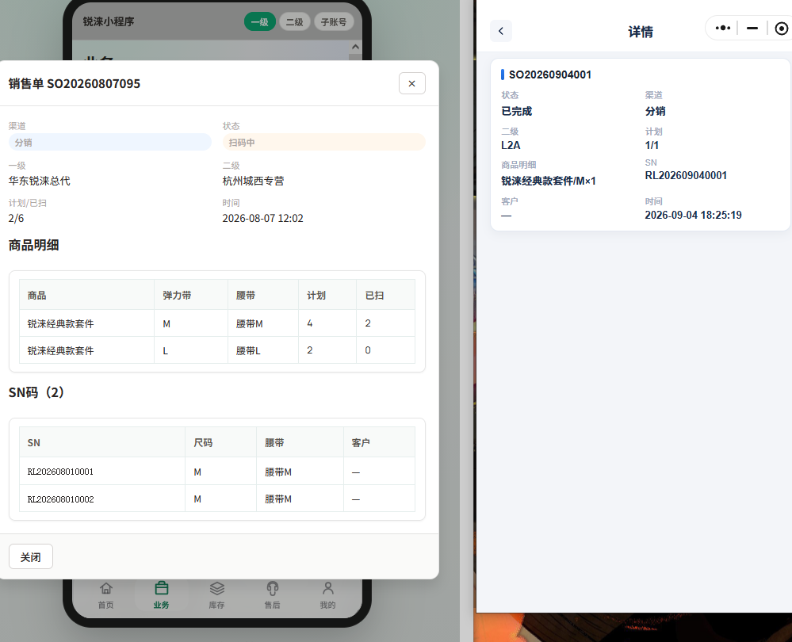

**反馈截图**

图1（414×780，原文件，非缩略图）：

---

## 17. 业务-销售 — 创建销售单页面重新做

- 表格行：67
- 反馈日期：9月7日
- 平台：小程序
- 模块：业务-销售
- 状态：**重新打开**

**问题描述**

创建销售单页面重新做

**反馈描述**

应该和创建采购单页面布局和内容是一样的

**原始截图**

图1（1045×862，原文件，非缩略图）：

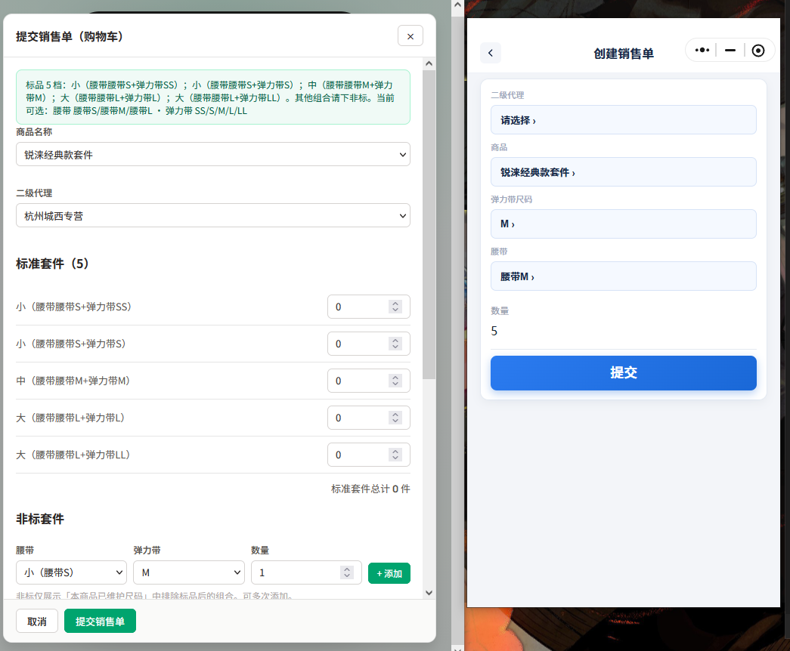

**反馈截图**

图1（414×780，原文件，非缩略图）：

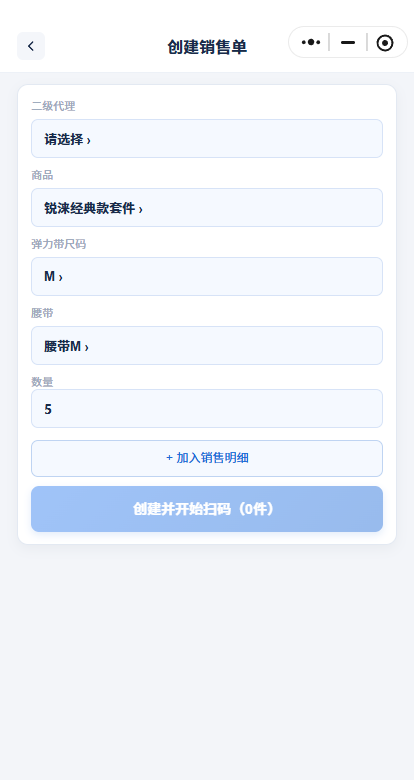

---

## 18. 业务-C端订单 — 详情信息和原型不匹配

- 表格行：68
- 反馈日期：9月7日
- 平台：小程序
- 模块：业务-C端订单
- 状态：**重新打开**

**问题描述**

详情信息和原型不匹配

**反馈描述**

详情信息和原型不匹配

**原始截图**

图1（1009×749，原文件，非缩略图）：

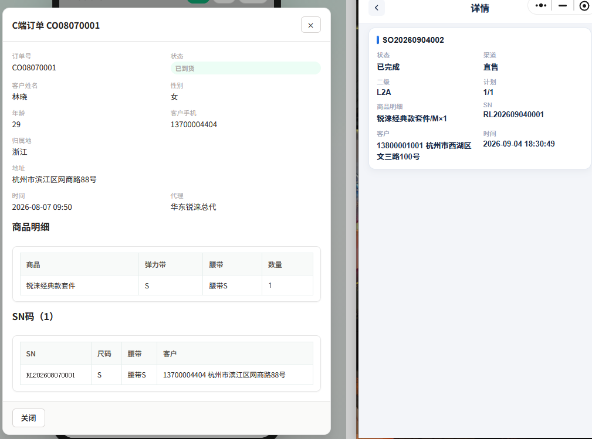

**反馈截图**

图1（414×780，原文件，非缩略图）：

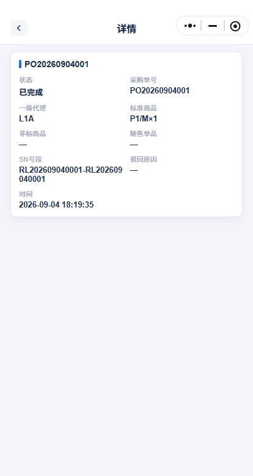

---

## 19. 库存-在库SN — 详情信息和原型不匹配

- 表格行：70
- 反馈日期：9月7日
- 平台：小程序
- 模块：库存-在库SN
- 状态：**重新打开**

**问题描述**

详情信息和原型不匹配
流转样式和PC的流转样式保持统一

**反馈描述**

详情信息和原型不匹配

**原始截图**

图1（1062×824，原文件，非缩略图）：

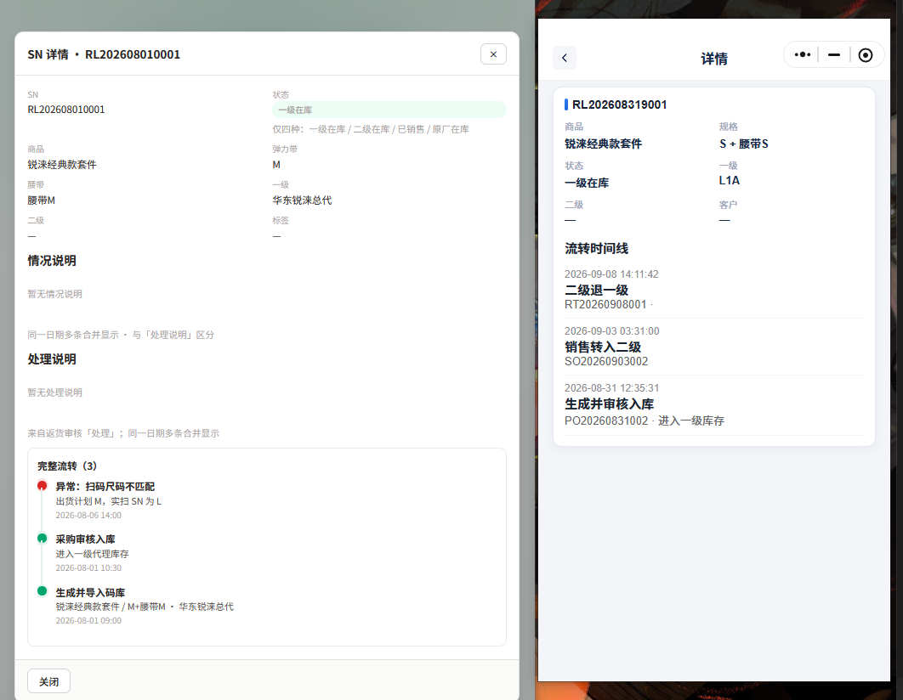

图2（363×475，原文件，非缩略图）：

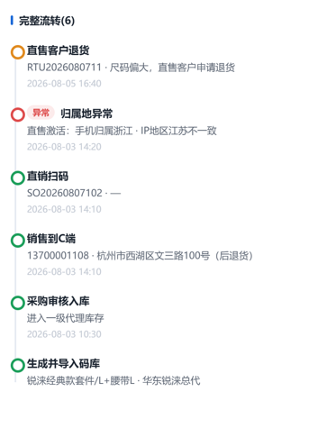

**反馈截图**

图1（414×780，原文件，非缩略图）：

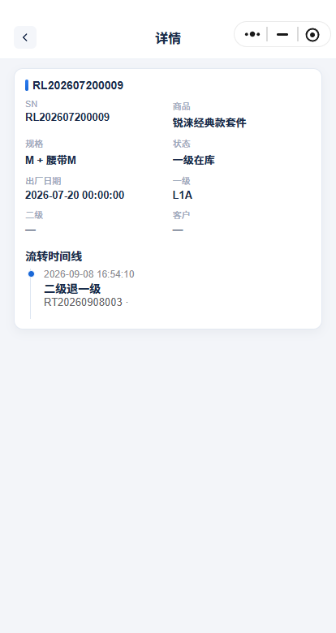

---

## 20. 库存-商品 — 当前开发的页面点击详情后直接跳转到在库SN列表页了，缺少详情页

- 表格行：71
- 反馈日期：9月7日
- 平台：小程序
- 模块：库存-商品
- 状态：**重新打开**

**问题描述**

当前开发的页面点击详情后直接跳转到在库SN列表页了，缺少详情页

**反馈描述**

1、详情页样式要和设计稿统一；
2、在库SN没数据；
3、规格是乱码

**原始截图**

图1（1481×834，原文件，非缩略图）：

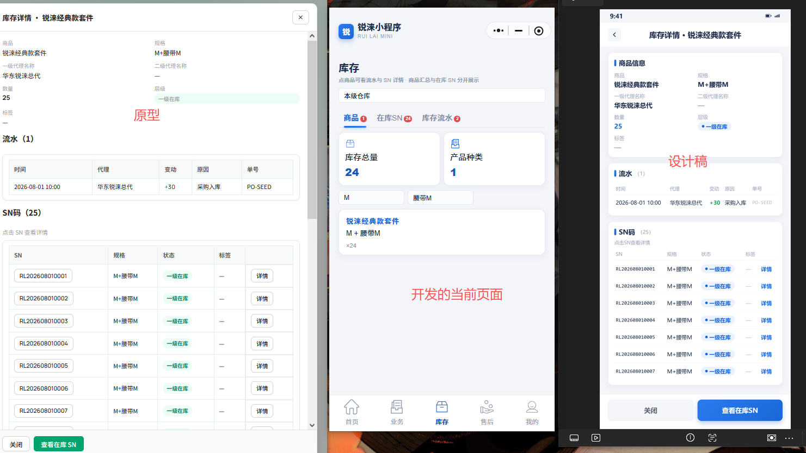

**反馈截图**

图1（414×780，原文件，非缩略图）：

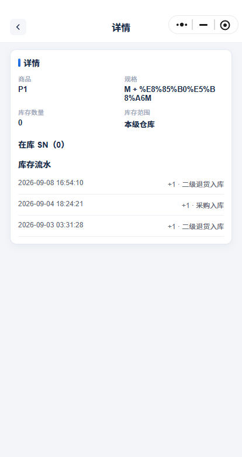

---

## 21. 售后 — 1、详情信息和原型不匹配

- 表格行：72
- 反馈日期：9月7日
- 平台：小程序
- 模块：售后
- 状态：**重新打开**

**问题描述**

1、详情信息和原型不匹配
2、样式调整成设计稿那样

**反馈描述**

详情页样式要和设计稿统一

**原始截图**

图1（1478×957，原文件，非缩略图）：

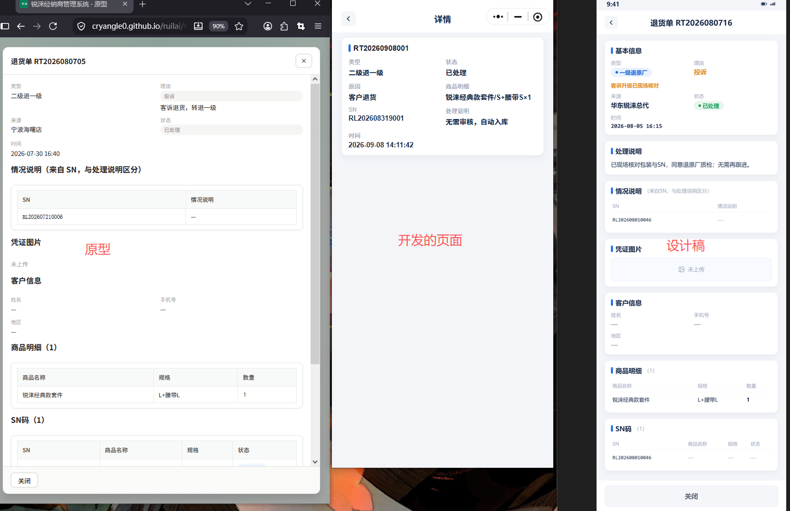

**反馈截图**

图1（414×780，原文件，非缩略图）：

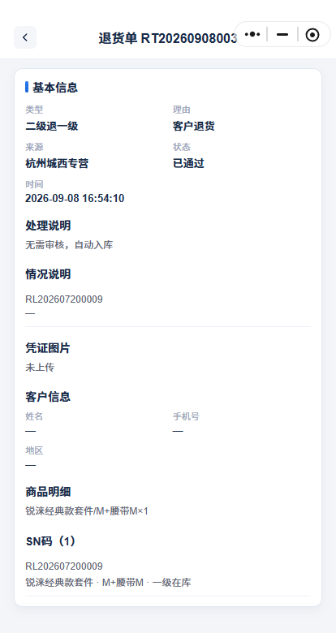

---

## 22. 异常 — 缺少客户信息

- 表格行：79
- 反馈日期：9月7日
- 平台：小程序
- 模块：异常
- 状态：**重新打开**

**问题描述**

缺少客户信息

**反馈描述**

详情页样式要和设计稿统一

**原始截图**

图1（1016×591，原文件，非缩略图）：

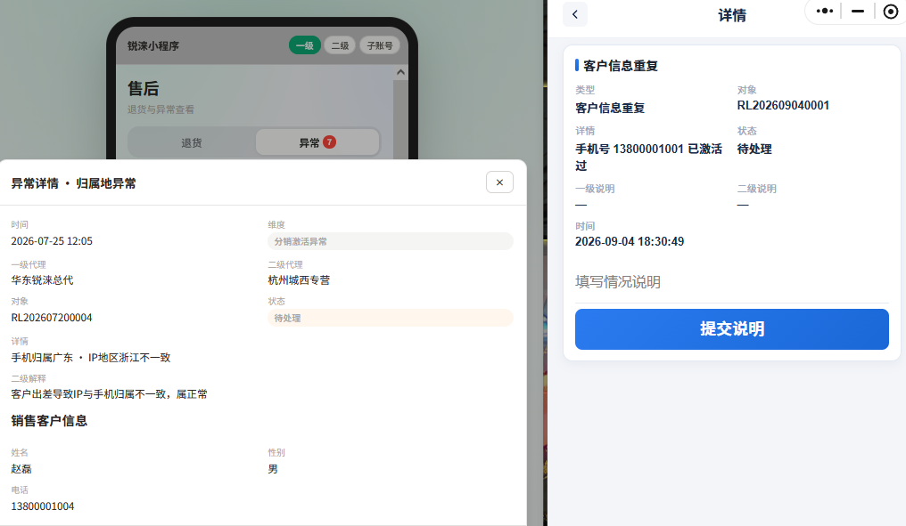

**反馈截图**

图1（414×780，原文件，非缩略图）：

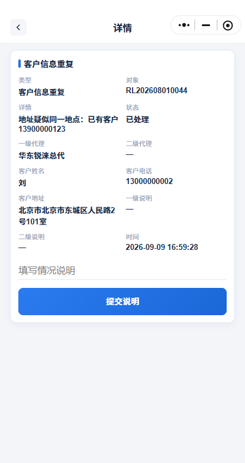

---

## 23. SN码库 — 显示异常未处理，但在异常管理里没看出来是什么异常

- 表格行：83
- 反馈日期：9月9日
- 平台：管理端
- 模块：SN码库
- 状态：**待处理**

**问题描述**

显示异常未处理，但在异常管理里没看出来是什么异常

**反馈描述**

（无）

**原始截图**

图1（1920×953，原文件，非缩略图）：

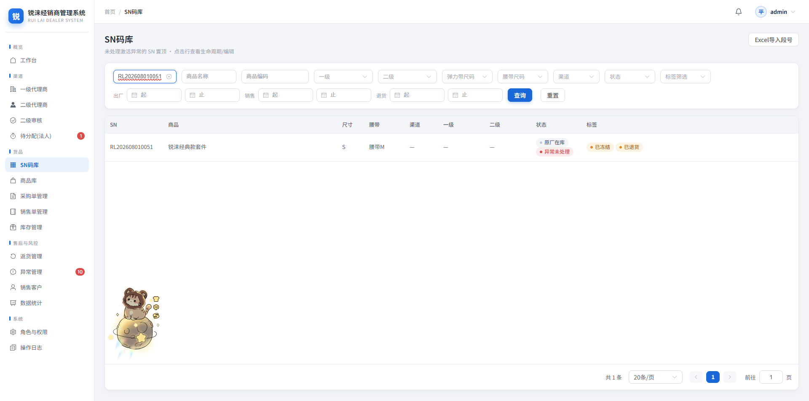

图2（1920×953，原文件，非缩略图）：

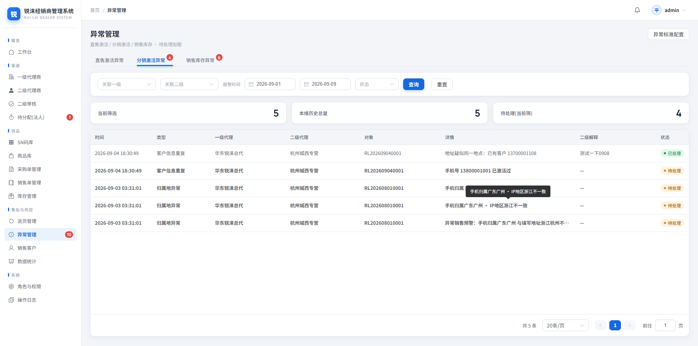

---

## 24. 异常管理 — 归属地异常详情里为什么会有异常销售预警

- 表格行：84
- 反馈日期：9月9日
- 平台：管理端
- 模块：异常管理
- 状态：**待处理**

**问题描述**

归属地异常详情里为什么会有异常销售预警

**反馈描述**

（无）

**原始截图**

图1（1920×953，原文件，非缩略图）：

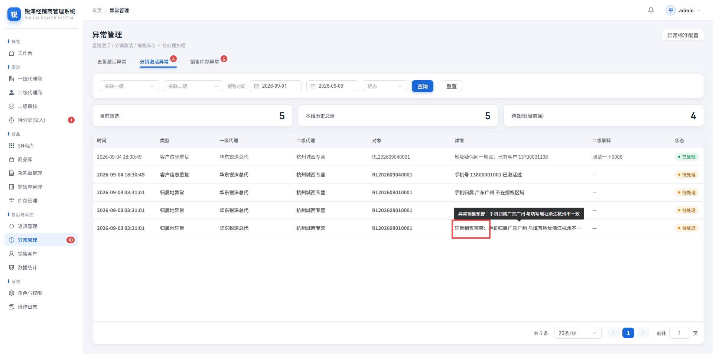

---

## 25. 扫码 — 提交了个直售然后扫码这里出现了上标 是什么原因，这里应该不需要上标

- 表格行：85
- 反馈日期：9月9日
- 平台：小程序
- 模块：扫码
- 状态：**待处理**

**问题描述**

提交了个直售然后扫码这里出现了上标 是什么原因，这里应该不需要上标

**反馈描述**

（无）

**原始截图**

图1（414×780，原文件，非缩略图）：

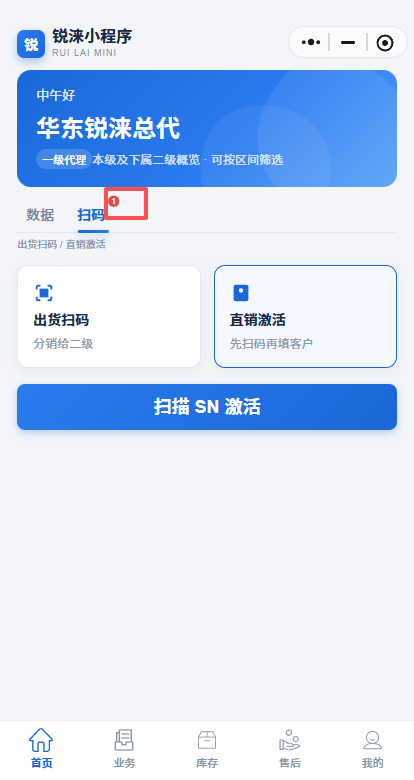

---

## 26. 异常管理 — 列表排序：待处理的置顶，按时间倒序排序

- 表格行：86
- 反馈日期：9月9日
- 平台：管理端
- 模块：异常管理
- 状态：**待处理**

**问题描述**

列表排序：待处理的置顶，按时间倒序排序

**反馈描述**

（无）

**原始截图**

图1（1920×953，原文件，非缩略图）：

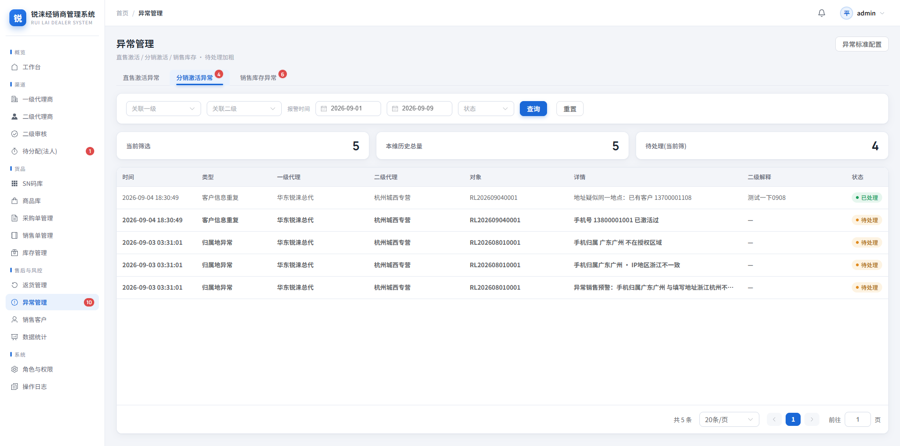

---

## 27. 销售单管理 — 这里为啥会有异常

- 表格行：87
- 反馈日期：9月9日
- 平台：管理端
- 模块：销售单管理
- 状态：**待处理**

**问题描述**

这里为啥会有异常

**反馈描述**

（无）

**原始截图**

图1（1920×953，原文件，非缩略图）：

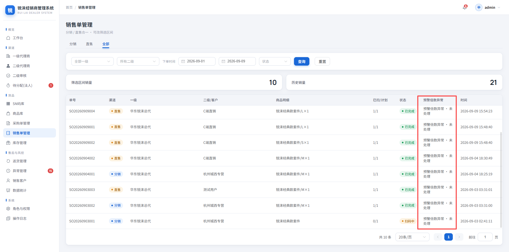

---

## 28. 异常管理 — 为啥这2个地址会判定疑似重复

- 表格行：88
- 反馈日期：9月9日
- 平台：管理端
- 模块：异常管理
- 状态：**待处理**

**问题描述**

为啥这2个地址会判定疑似重复

**反馈描述**

（无）

**原始截图**

图1（1546×561，原文件，非缩略图）：

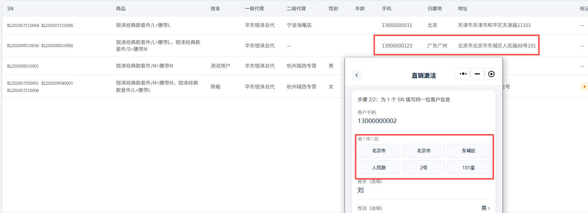

---

## 29. 异常管理 — 报了异常但是销售客户这里没有标记

- 表格行：89
- 反馈日期：9月9日
- 平台：管理端
- 模块：异常管理
- 状态：**待处理**

**问题描述**

报了异常但是销售客户这里没有标记

**反馈描述**

（无）

**原始截图**

图1（1920×953，原文件，非缩略图）：

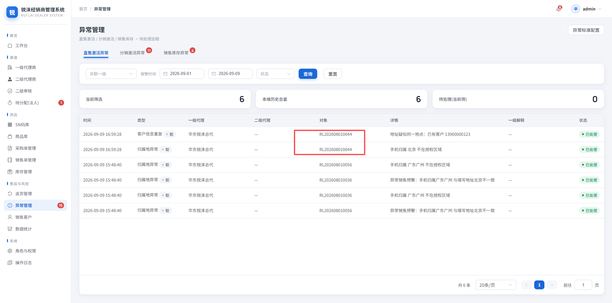

图2（1920×953，原文件，非缩略图）：

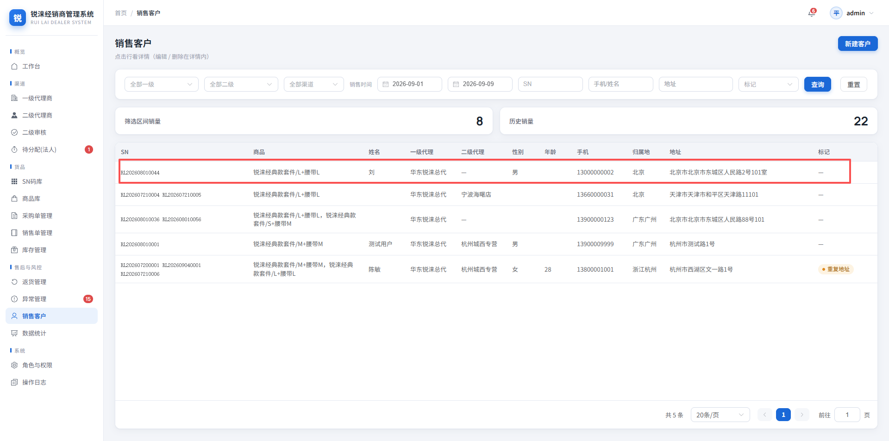

---

## 30. 异常管理 — 激活异常筛选项增加“SN”

- 表格行：90
- 反馈日期：9月9日
- 平台：管理端,小程序
- 模块：异常管理
- 状态：**待处理**

**问题描述**

激活异常筛选项增加“SN”

**反馈描述**

（无）

**原始截图**

图1（1920×953，原文件，非缩略图）：

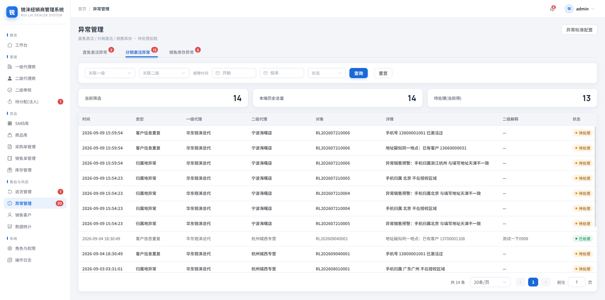

---

## 31. 创建代理账号 — 登录用户名没有校验重复，现在是重复之后会把之前的用户名直接清空

- 表格行：92
- 反馈日期：9月9日
- 平台：管理端,小程序
- 模块：创建代理账号
- 状态：**待处理**

**问题描述**

登录用户名没有校验重复，现在是重复之后会把之前的用户名直接清空

**反馈描述**

（无）

**原始截图**

图1（1920×953，原文件，非缩略图）：

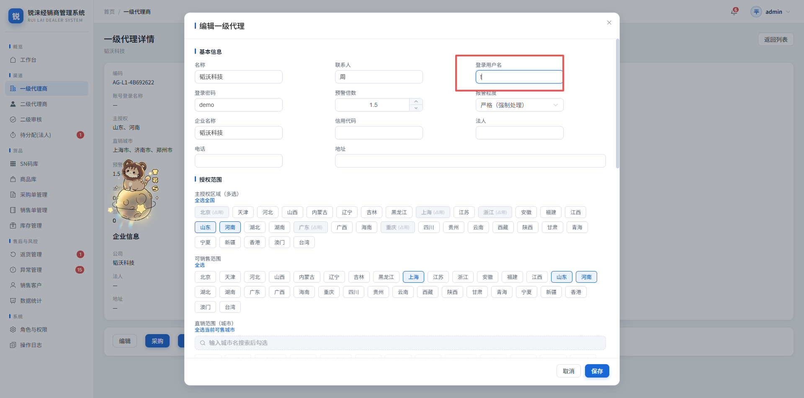

---
