# 问题修改清单（2026-09-08）

本目录在锐涞仓库内。解压对照也可用仓库根目录 `锐涞-81条问题图文.zip`，或直接打开 `打开图文.html`。

来源：[企业微信文档表格](https://doc.weixin.qq.com/sheet/e3_AXwAFAYYAHoCNd0r367mETBGD1tjM?tab=hoj4ui)（工作表：问题修改清单）

导出时间：2026-09-08。共 **81** 条，图片 **90** 张，其中待处理/确认 **81** 条。

| # | 反馈日期 | 平台 | 模块 | 问题描述 | 状态 | 备注 | 图 |
|---|----------|------|------|----------|------|------|----|
| 1 | 9月7日 | 管理端 | 工作台 | 1、去掉“查看全部待办”按钮；2、调整待办事项卡片宽度，右边不要有空白 | 已验证 | 批次1：Web契约与构建通过 | 1 |
| 2 | 9月7日 | 管理端 | 一级代理/二级代理/待分配 | 一级代理、二级代理、待分配详情里选择省市的范围需要改成完整的全国的，现在都只有一部分 | 已验证 | 批次1：全国城市可见，父级未授权城市禁选 | 1 |
| 3 | 9月7日 | 管理端 | 一级代理/二级代理 | 状态列往右边移一点，列宽调小点 | 已验证 | 批次1：状态列统一150px | 1 |
| 4 | 9月7日 | 管理端 | 二级代理 | 二级代理编辑页面样式布局要改成和一级代理一样的 | 已验证 | 批次1：对齐一级分区三列表单 | 2 |
| 5 | 9月7日 | 管理端 | 二级审核 | 1、登录账号未显示；2、去掉“合作协议”字段 | 已验证 | 批次1：登录账号由后端填充，移除合作协议 | 1 |
| 6 | 9月7日 | 管理端 | 二级审核 | 弹窗改成横向的，且下面不要留这么多空白。 | 已验证 | 批次1：900px横向、内容高度 | 1 |
| 7 | 9月7日 | 管理端 | 二级审核/待分配/采购单管理 | 待审核、已通过、已驳回、全部必须要右上角的数字 | 已验证 | 批次1：页签数字含0，采购补已驳回 | 1 |
| 8 | 9月7日 | 管理端 | 二级审核/待分配/采购单管理 | 左侧菜单只有当有需要待办事项的时候才显示数字图标，待办已全部处理了则不需要显示 | 已验证 | 批次1：非零显示并在处理后刷新 | 1 |
| 9 | 9月7日 | 管理端 | 待分配 | 详情的弹窗改成横向的，且下面不要留这么多空白。 | 已验证 | 批次1：820px横向、内容高度 | 1 |
| 10 | 9月7日 | 管理端 | 待分配 | 重新绑定的弹窗改成横向的，且下面不要留这么多空白。 | 已验证 | 批次1：920px横向、内容高度 | 1 |
| 11 | 9月7日 | 管理端 | SN码库 | 去掉“系统生成SN”按钮 | 待处理 |  | 1 |
| 12 | 9月7日 | 管理端 | SN码库 | 起止日期不要换行 | 待处理 |  | 1 |
| 13 | 9月7日 | 管理端 | SN码库 | 列宽调整：SN、商品、尺寸列宽太大了，后面几列列宽太小，需要调整平衡一点 | 待处理 |  | 1 |
| 14 | 9月7日 | 管理端 | SN码库 | 商品编码改成输入框，搜索的编码，现在下拉框选择的是商品名称 | 待处理 |  | 1 |
| 15 | 9月7日 | 管理端 | SN码库 | 1、标签筛选下拉框选项去掉“个性化”，增加再入库；2、去掉标签“修理过”、“个性化” | 待处理 |  | 2 |
| 16 | 9月7日 | 管理端 | SN码库 | 出厂日期是怎么算的 | 待处理 |  | 1 |
| 17 | 9月7日 | 管理端 | SN码库 | 状态已销售，但没有流转事件 | 待处理 |  | 1 |
| 18 | 9月7日 | 管理端 | SN码库 | 1、修改页面情况说明和处理说明内容和原型不一致，缺少填写日期；2、所属二级（调库）不要换行 | 待处理 |  | 1 |
| 19 | 9月7日 | 管理端 | 商品库 | 套件和单品修改/新建页面“取消全选”按钮和填写新增的输入框都没对齐，且还分别和前后的框粘连了 | 待处理 |  | 1 |
| 20 | 9月7日 | 管理端 | 商品库 | 单品下面大片空白去掉 | 待处理 |  | 1 |
| 21 | 9月7日 | 管理端 | 采购单管理/销售单管理/库存管理/返货管理/异常管理/销售客户 | 筛选和数据汇总区域样式和设计稿不统一 | 待处理 |  | 1 |
| 22 | 9月7日 | 管理端 | 采购单管理/返货管理/异常管理/销售客户 | 下单起止时间默认选中当前月份 | 待处理 |  | 1 |
| 23 | 9月7日 | 管理端 | 采购单管理 | 配件改成单品 | 待处理 |  | 1 |
| 24 | 9月7日 | 管理端 | 采购单管理 | 非标品始终显示SS+腰带SS，怎么选择其他规格 | 待处理 |  | 1 |
| 25 | 9月7日 | 管理端 | 采购单管理 | 已填写号段显示为10，但是无法确认保存，提示已填0 | 待处理 |  | 1 |
| 26 | 9月7日 | 管理端 | 采购单管理 | 已完成后面增加已驳回的状态标签切换 | 待处理 |  | 1 |
| 27 | 9月7日 | 管理端 | 采购单管理 | 当状态是已驳回，增加一个字段：驳回原因（就是驳回时候弹窗填写的内容） | 待处理 |  | 2 |
| 28 | 9月7日 | 管理端 | 销售单管理 | 标签上的数字去掉 | 待处理 |  | 1 |
| 29 | 9月7日 | 管理端 | 销售单管理 | 时间筛选前面加文字下单时间 | 待处理 |  | 1 |
| 30 | 9月7日 | 管理端 | 销售单管理 | 详情下面大片空白去掉 | 待处理 |  | 1 |
| 31 | 9月7日 | 管理端 | 库存管理 | 标签上的数字去掉 | 待处理 |  | 1 |
| 32 | 9月7日 | 管理端 | 库存管理 | 库存流水没有记录 | 待处理 |  | 1 |
| 33 | 9月7日 | 管理端 | 返货管理 | 只有当一级代理退原厂有需要审核的时候，一级代理退原厂这里才会有上标数字，其他的标签的上标数字都去掉 | 待处理 |  | 1 |
| 34 | 9月7日 | 管理端 | 返货管理 | 这2种描述是同一个类型，描述应该统一：终端退货 | 待处理 |  | 1 |
| 35 | 9月7日 | 管理端 | 返货管理 | 1、文字修改：处理改成驳回，审核通过改成通过；2、点击审核通过或者驳回之后，需要加二次确认的弹窗 | 待处理 |  | 1 |
| 36 | 9月7日 | 管理端 | 返货管理 | 列表上的状态和标签切换的状态对不上，标签上已处理改成已驳回；列表上的已处理改成已通过 | 待处理 |  | 1 |
| 37 | 9月7日 | 管理端 | 返货管理/SN码库 | RL202608010041 该SN商品已发生售后，但SN码库里没有状态流转；且驳回时候填写的处理说明未在SN码库中同步显示；；在SN码库中编辑的情况说明在返货管理里也没有同步显示； | 待处理 |  | 3 |
| 38 | 9月7日 | 管理端 | 异常管理 | 这是什么意思 有什么功能 | 待处理 |  | 1 |
| 39 | 9月7日 | 管理端 | 异常管理 | 1、异常标准配置的超量比和周转倍数去掉；2、下方大片空白去掉 | 待处理 |  | 1 |
| 40 | 9月7日 | 管理端 | 异常管理 | 销售库存异常里的一级代理未显示 | 待处理 |  | 1 |
| 41 | 9月7日 | 管理端 | 异常管理 | 同一笔订单里两件商品不应该报重复异常 | 待处理 |  | 2 |
| 42 | 9月7日 | 管理端 | 异常管理 | 分销激活异常和直售激活异常的功能是一样的，区别在于直售激活异常是一级代理销售给C端用户时的激活异常，分销激活异常是指二级代理销售给C端用户时的激活异常。异常类型为：归属地异常、客户信息重复、IP异常 | 待处理 |  | 0 |
| 43 | 9月7日 | 管理端 | 异常管理 | 时间筛选前面加文字报警时间 | 待处理 |  | 1 |
| 44 | 9月7日 | 管理端 | 异常管理 | 弹窗提示下面大片空白去掉 | 待处理 |  | 1 |
| 45 | 9月7日 | 管理端 | 销售客户 | 时间筛选未生效，只有第一条是9月的，其他都是8月的 | 待处理 |  | 1 |
| 46 | 9月7日 | 管理端 | 销售客户 | 1、筛选的标记下拉框应该是重复地址、重复手机号，去掉仅重复；2、因为小程序上无法输入地址，暂时无法验证当手机号也重复时会怎么提示。需要系统自己验证下，正确效果是同时显示重复手机号和重复地址两个标签并列 | 待处理 |  | 1 |
| 47 | 9月7日 | 管理端 | 数据统计 | 1、区间激活数换行放到累计激活数前面；2、每个卡片宽度调整，平铺满 | 待处理 |  | 1 |
| 48 | 9月7日 | 管理端 | 数据统计 | 二级代理应该不存在直售数，直售是指一级代理直接销售给C端用户 | 待处理 |  | 1 |
| 49 | 9月7日 | 管理端 | 数据统计 | 1、本级销售构成改成销售渠道；2、缺少一级代理排行；3、累计激活数这一排的卡片和下面的图表中间缺少间隔；4、下面图表布局调整成和设计稿一样 | 待处理 |  | 1 |
| 50 | 9月7日 | 管理端 | 角色与权限 | 创建角色时选的这些是什么意思，没看懂 | 待处理 |  | 1 |
| 51 | 9月7日 | 管理端 | 角色与权限 | 角色操作这里增加删除按钮，可以删除没有绑定过账号的角色 | 待处理 |  | 1 |
| 52 | 9月7日 | 管理端 | 角色与权限 | 账号要可以修改密码 | 待处理 |  | 1 |
| 53 | 9月7日 | 管理端 | 通知 | 点击之后跳转至列表页 | 待处理 |  | 1 |
| 54 | 9月7日 | 小程序 | 数据 | 1、日期选择区域样式调整成设计稿那样；2、当前在库数放到图表上方；3、下面图表数据用左右切换的，移动端可以左右滑动交互效果 | 待处理 |  | 1 |
| 55 | 9月7日 | 小程序 | 数据 | 在手机上图表遮挡了菜单 | 待处理 |  | 1 |
| 56 | 9月7日 | 小程序 | 扫码 | 1、去掉查询扫码；2、卡片调整到合适宽度；3、按钮上下间隙调大一点；4、下方待扫描的缺少商品名称、进度 | 待处理 |  | 1 |
| 57 | 9月7日 | 小程序 | 扫码 | 1、缺少输入sn码的框；2、缺少下一步填写客户信息 | 待处理 |  | 1 |
| 58 | 9月7日 | 小程序 | 扫码 | 应该可以一单扫码/输入多个SN码 | 待处理 |  | 1 |
| 59 | 9月7日 | 小程序 | 扫码 | 输入不进去，填写没反应 | 待处理 |  | 1 |
| 60 | 9月7日 | 小程序 | 扫码 | 地址的样式改成  [省 ▼] [市 ▼] [区 ▼]    [____路] [____号/弄] [____室]；，省市区是下拉框且联动的，路号室是输入框 | 待处理 |  | 1 |
| 61 | 9月7日 | 小程序 | 业务-采购 | 1、标签上只显示待处理和会签中的数字，已完成和全部的不需要显示上标；2、已完成后面增加标签已驳回；3、列表上缺少号段 | 待处理 |  | 3 |
| 62 | 9月7日 | 小程序 | 业务-采购 | 1、详情信息和原型不匹配；2、号段不要有代码 | 待处理 |  | 2 |
| 63 | 9月7日 | 小程序 | 业务-采购 | 创建采购单页面重新做 | 待处理 |  | 1 |
| 64 | 9月7日 | 小程序 | 业务-销售 | 缺少号段 | 待处理 |  | 1 |
| 65 | 9月7日 | 小程序 | 业务-销售 | 详情信息和原型不匹配 | 待处理 |  | 1 |
| 66 | 9月7日 | 小程序 | 业务-销售 | 创建销售单页面重新做 | 待处理 |  | 1 |
| 67 | 9月7日 | 小程序 | 业务-C端订单 | 详情信息和原型不匹配 | 待处理 |  | 1 |
| 68 | 9月7日 | 小程序 | 库存 | 去掉标签上的数字 | 待处理 |  | 1 |
| 69 | 9月7日 | 小程序 | 库存-在库SN | 详情信息和原型不匹配；流转样式和PC的流转样式保持统一 | 待处理 |  | 2 |
| 70 | 9月7日 | 小程序 | 库存-商品 | 当前开发的页面点击详情后直接跳转到在库SN列表页了，缺少详情页 | 待处理 |  | 1 |
| 71 | 9月7日 | 小程序 | 售后 | 1、详情信息和原型不匹配；2、样式调整成设计稿那样 | 待处理 |  | 1 |
| 72 | 9月7日 | 小程序 | 售后 | 列表上标签没有加样式 | 待处理 |  | 1 |
| 73 | 9月7日 | 小程序 | 售后 | 去掉标签上的数字，仅显示待处理的数字 | 待处理 |  | 1 |
| 74 | 9月7日 | 小程序 | 售后 | 输入不进去，填写没反应 | 待处理 |  | 1 |
| 75 | 9月7日 | 小程序 | 售后 | 填写二级退一级/填写终端退货单/申请退原厂的SN都只能填一个，应该要可以填写多个或者扫描多个 | 待处理 |  | 1 |
| 76 | 9月7日 | 小程序 | 售后 | 列表上的状态和标签切换的状态对不上，标签上已处理改成已驳回；列表上的已处理改成已通过 | 待处理 |  | 1 |
| 77 | 9月7日 | 小程序 | 售后 | 去掉标签上的数字，仅显示待审核的数字 | 待处理 |  | 1 |
| 78 | 9月7日 | 小程序 | 异常 | 缺少客户信息 | 待处理 |  | 1 |
| 79 | 9月7日 | 小程序 | 异常 | 分销激活异常和直售激活异常的功能是一样的，区别在于直售激活异常是一级代理销售给C端用户时的激活异常，分销激活异常是指二级代理销售给C端用户时的激活异常。异常类型为：归属地异常、客户信息重复、IP异常 | 待处理 |  | 1 |
| 80 | 9月7日 | 小程序 | 异常 | 筛选项增加二级代理下拉框 | 待处理 |  | 1 |
| 81 | 9月7日 | 小程序 | 异常 | PC有数据，但小程序上未显示 | 待处理 |  | 1 |

---

## 1. 工作台 — 1、去掉“查看全部待办”按钮

- 反馈日期：9月7日
- 平台：管理端
- 模块：工作台
- 状态：已验证
- 备注：批次1：Web契约与构建通过
- 表格行：2

**问题描述**

1、去掉“查看全部待办”按钮
2、调整待办事项卡片宽度，右边不要有空白

**截图**

图1：

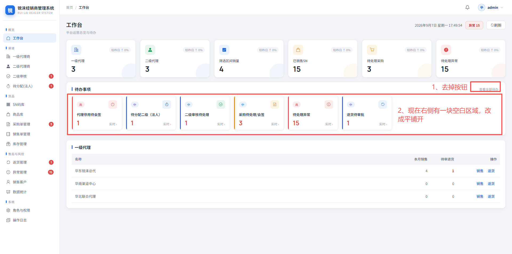

---

## 2. 一级代理/二级代理/待分配 — 一级代理、二级代理、待分配详情里选择省市的范围需要改成完整的全国的，现在都只有一部分

- 反馈日期：9月7日
- 平台：管理端
- 模块：一级代理/二级代理/待分配
- 状态：已验证
- 备注：批次1：全国城市可见，父级未授权城市禁选
- 表格行：3

**问题描述**

一级代理、二级代理、待分配详情里选择省市的范围需要改成完整的全国的，现在都只有一部分

**截图**

图1：

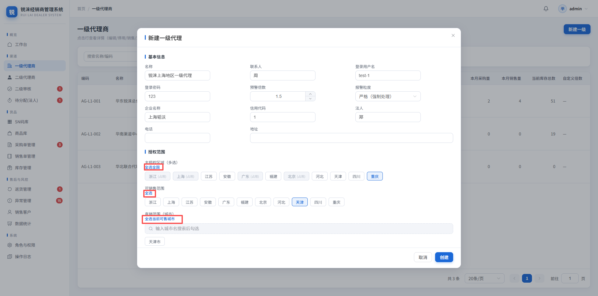

---

## 3. 一级代理/二级代理 — 状态列往右边移一点，列宽调小点

- 反馈日期：9月7日
- 平台：管理端
- 模块：一级代理/二级代理
- 状态：已验证
- 备注：批次1：状态列统一150px
- 表格行：4

**问题描述**

状态列往右边移一点，列宽调小点

**截图**

图1：

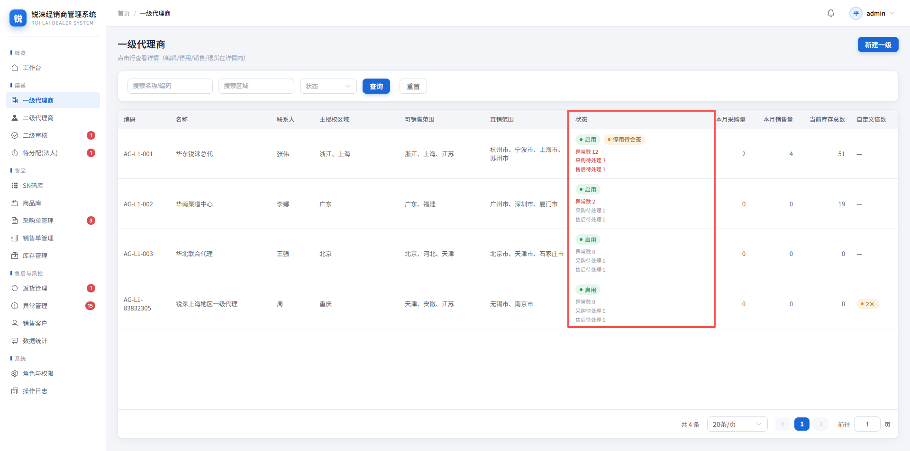

---

## 4. 二级代理 — 二级代理编辑页面样式布局要改成和一级代理一样的

- 反馈日期：9月7日
- 平台：管理端
- 模块：二级代理
- 状态：已验证
- 备注：批次1：对齐一级分区三列表单
- 表格行：5

**问题描述**

二级代理编辑页面样式布局要改成和一级代理一样的

**截图**

图1：

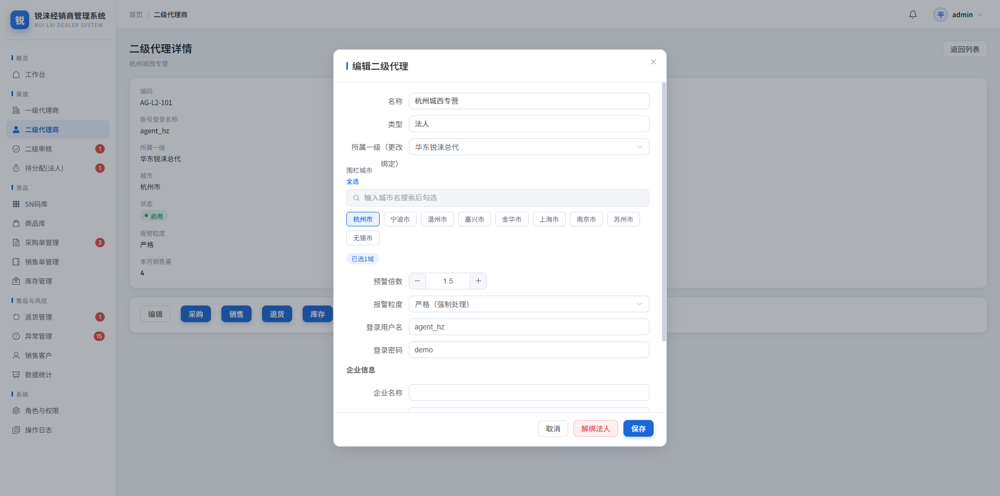

图2：

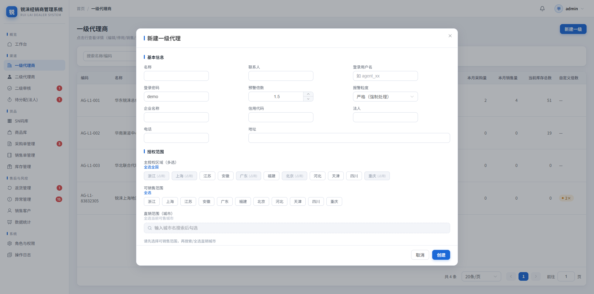

---

## 5. 二级审核 — 1、登录账号未显示

- 反馈日期：9月7日
- 平台：管理端
- 模块：二级审核
- 状态：已验证
- 备注：批次1：登录账号由后端填充，移除合作协议
- 表格行：6

**问题描述**

1、登录账号未显示
2、去掉“合作协议”字段

**截图**

图1：

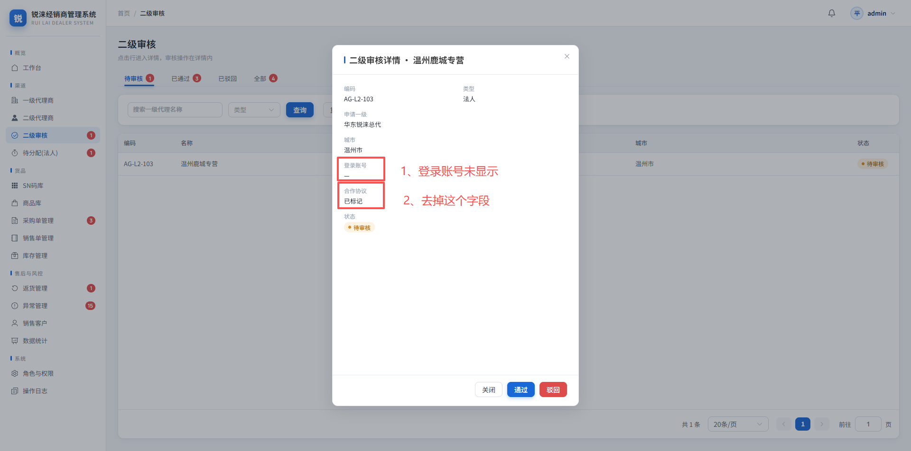

---

## 6. 二级审核 — 弹窗改成横向的，且下面不要留这么多空白。

- 反馈日期：9月7日
- 平台：管理端
- 模块：二级审核
- 状态：已验证
- 备注：批次1：900px横向、内容高度
- 表格行：7

**问题描述**

弹窗改成横向的，且下面不要留这么多空白。

**截图**

图1：

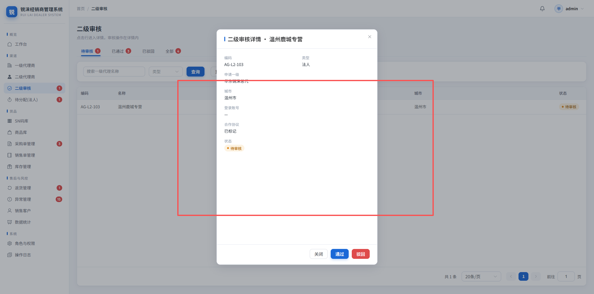

---

## 7. 二级审核/待分配/采购单管理 — 待审核、已通过、已驳回、全部必须要右上角的数字

- 反馈日期：9月7日
- 平台：管理端
- 模块：二级审核/待分配/采购单管理
- 状态：已验证
- 备注：批次1：页签数字含0，采购补已驳回
- 表格行：8

**问题描述**

待审核、已通过、已驳回、全部必须要右上角的数字

**截图**

图1：

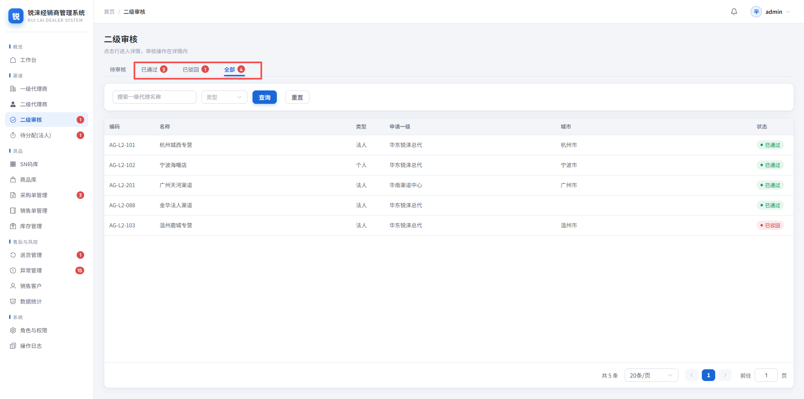

---

## 8. 二级审核/待分配/采购单管理 — 左侧菜单只有当有需要待办事项的时候才显示数字图标，待办已全部处理了则不需要显示

- 反馈日期：9月7日
- 平台：管理端
- 模块：二级审核/待分配/采购单管理
- 状态：已验证
- 备注：批次1：非零显示并在处理后刷新
- 表格行：9

**问题描述**

左侧菜单只有当有需要待办事项的时候才显示数字图标，待办已全部处理了则不需要显示

**截图**

图1：

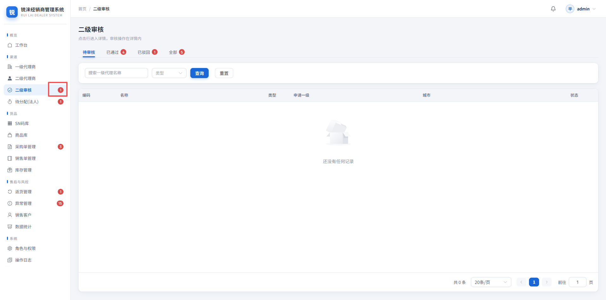

---

## 9. 待分配 — 详情的弹窗改成横向的，且下面不要留这么多空白。

- 反馈日期：9月7日
- 平台：管理端
- 模块：待分配
- 状态：已验证
- 备注：批次1：820px横向、内容高度
- 表格行：10

**问题描述**

详情的弹窗改成横向的，且下面不要留这么多空白。

**截图**

图1：

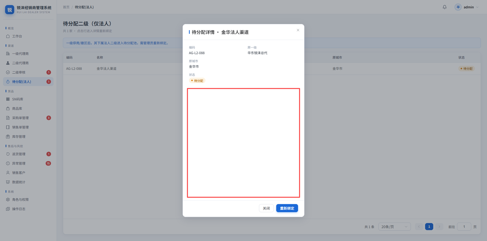

---

## 10. 待分配 — 重新绑定的弹窗改成横向的，且下面不要留这么多空白。

- 反馈日期：9月7日
- 平台：管理端
- 模块：待分配
- 状态：已验证
- 备注：批次1：920px横向、内容高度
- 表格行：11

**问题描述**

重新绑定的弹窗改成横向的，且下面不要留这么多空白。

**截图**

图1：

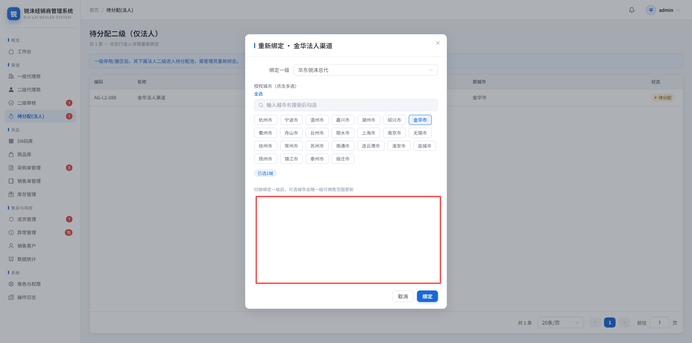

---

## 11. SN码库 — 去掉“系统生成SN”按钮

- 反馈日期：9月7日
- 平台：管理端
- 模块：SN码库
- 状态：待处理
- 备注：无
- 表格行：12

**问题描述**

去掉“系统生成SN”按钮

**截图**

图1：

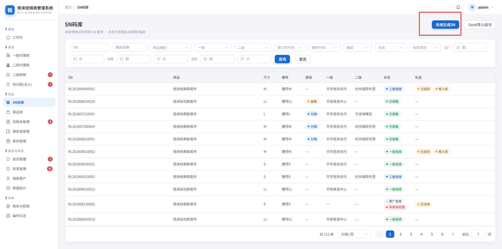

---

## 12. SN码库 — 起止日期不要换行

- 反馈日期：9月7日
- 平台：管理端
- 模块：SN码库
- 状态：待处理
- 备注：无
- 表格行：13

**问题描述**

起止日期不要换行

**截图**

图1：

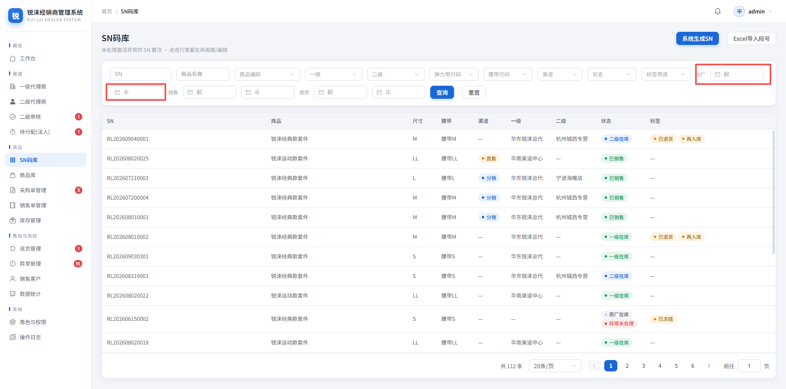

---

## 13. SN码库 — 列宽调整：SN、商品、尺寸列宽太大了，后面几列列宽太小，需要调整平衡一点

- 反馈日期：9月7日
- 平台：管理端
- 模块：SN码库
- 状态：待处理
- 备注：无
- 表格行：14

**问题描述**

列宽调整：SN、商品、尺寸列宽太大了，后面几列列宽太小，需要调整平衡一点

**截图**

图1：

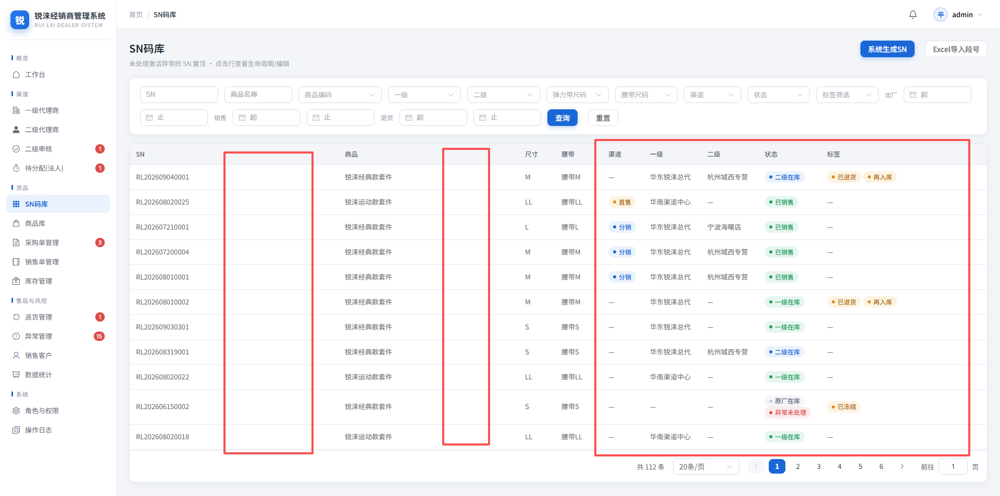

---

## 14. SN码库 — 商品编码改成输入框，搜索的编码，现在下拉框选择的是商品名称

- 反馈日期：9月7日
- 平台：管理端
- 模块：SN码库
- 状态：待处理
- 备注：无
- 表格行：15

**问题描述**

商品编码改成输入框，搜索的编码，现在下拉框选择的是商品名称

**截图**

图1：

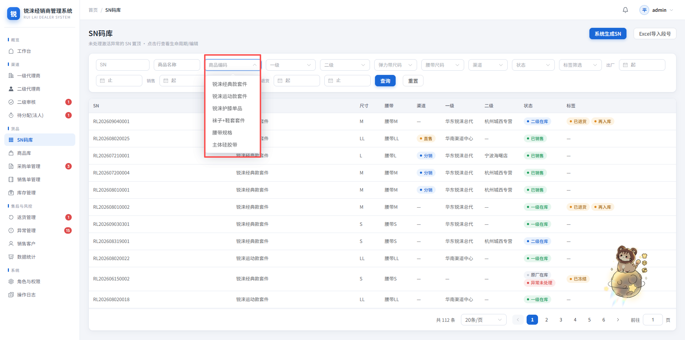

---

## 15. SN码库 — 1、标签筛选下拉框选项去掉“个性化”，增加再入库

- 反馈日期：9月7日
- 平台：管理端
- 模块：SN码库
- 状态：待处理
- 备注：无
- 表格行：16

**问题描述**

1、标签筛选下拉框选项去掉“个性化”，增加再入库
2、去掉标签“修理过”、“个性化”

**截图**

图1：

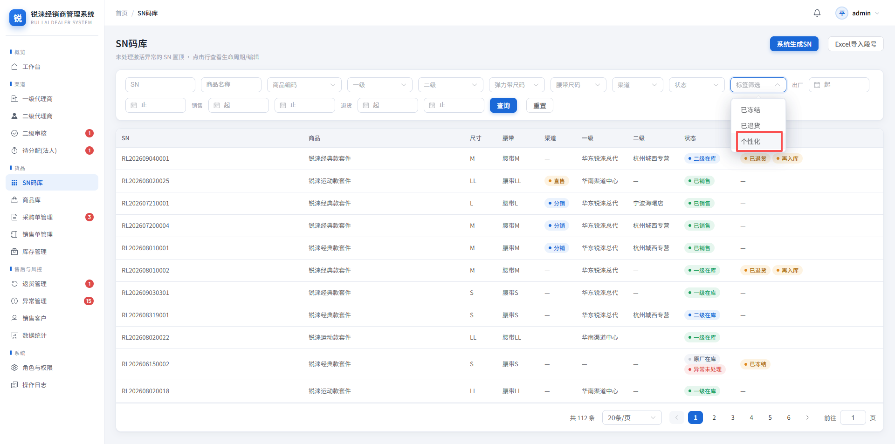

图2：

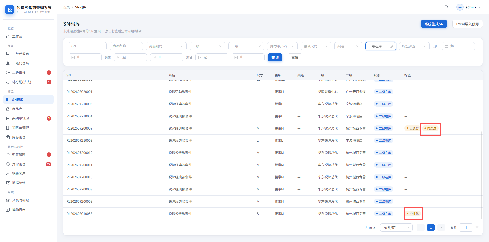

---

## 16. SN码库 — 出厂日期是怎么算的

- 反馈日期：9月7日
- 平台：管理端
- 模块：SN码库
- 状态：待处理
- 备注：无
- 表格行：17

**问题描述**

出厂日期是怎么算的

**截图**

图1：

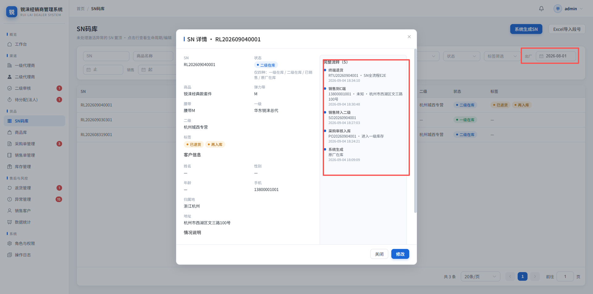

---

## 17. SN码库 — 状态已销售，但没有流转事件

- 反馈日期：9月7日
- 平台：管理端
- 模块：SN码库
- 状态：待处理
- 备注：无
- 表格行：18

**问题描述**

状态已销售，但没有流转事件

**截图**

图1：

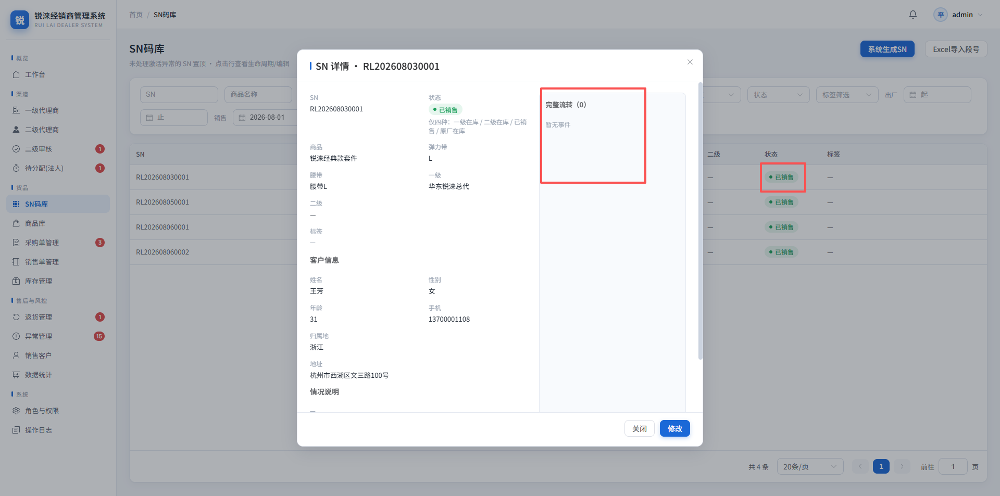

---

## 18. SN码库 — 1、修改页面情况说明和处理说明内容和原型不一致，缺少填写日期

- 反馈日期：9月7日
- 平台：管理端
- 模块：SN码库
- 状态：待处理
- 备注：无
- 表格行：19

**问题描述**

1、修改页面情况说明和处理说明内容和原型不一致，缺少填写日期
2、所属二级（调库）不要换行

**截图**

图1：

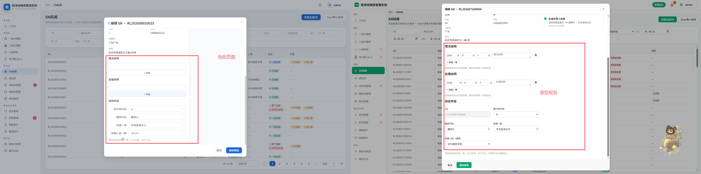

---

## 19. 商品库 — 套件和单品修改/新建页面“取消全选”按钮和填写新增的输入框都没对齐，且还分别和前后的框粘连了

- 反馈日期：9月7日
- 平台：管理端
- 模块：商品库
- 状态：待处理
- 备注：无
- 表格行：20

**问题描述**

套件和单品修改/新建页面“取消全选”按钮和填写新增的输入框都没对齐，且还分别和前后的框粘连了

**截图**

图1：

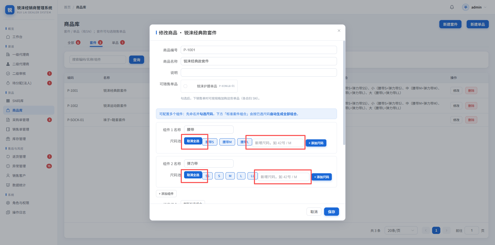

---

## 20. 商品库 — 单品下面大片空白去掉

- 反馈日期：9月7日
- 平台：管理端
- 模块：商品库
- 状态：待处理
- 备注：无
- 表格行：21

**问题描述**

单品下面大片空白去掉

**截图**

图1：

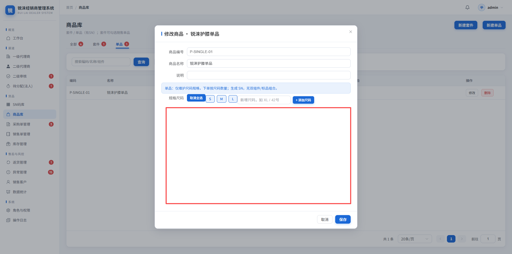

---

## 21. 采购单管理/销售单管理/库存管理/返货管理/异常管理/销售客户 — 筛选和数据汇总区域样式和设计稿不统一

- 反馈日期：9月7日
- 平台：管理端
- 模块：采购单管理/销售单管理/库存管理/返货管理/异常管理/销售客户
- 状态：待处理
- 备注：无
- 表格行：22

**问题描述**

筛选和数据汇总区域样式和设计稿不统一

**截图**

图1：

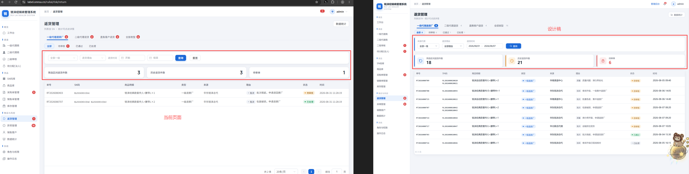

---

## 22. 采购单管理/返货管理/异常管理/销售客户 — 下单起止时间默认选中当前月份

- 反馈日期：9月7日
- 平台：管理端
- 模块：采购单管理/返货管理/异常管理/销售客户
- 状态：待处理
- 备注：无
- 表格行：23

**问题描述**

下单起止时间默认选中当前月份

**截图**

图1：

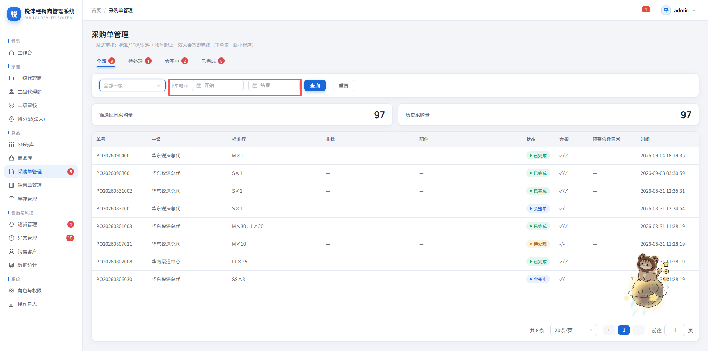

---

## 23. 采购单管理 — 配件改成单品

- 反馈日期：9月7日
- 平台：管理端
- 模块：采购单管理
- 状态：待处理
- 备注：无
- 表格行：24

**问题描述**

配件改成单品

**截图**

图1：

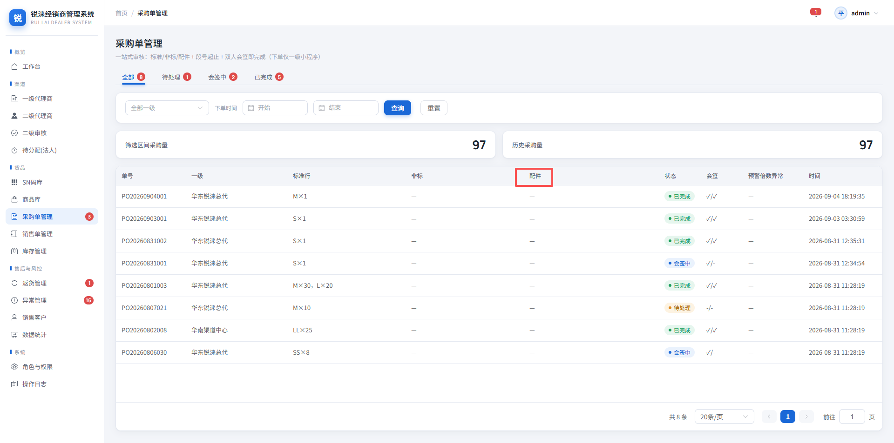

---

## 24. 采购单管理 — 非标品始终显示SS+腰带SS，怎么选择其他规格

- 反馈日期：9月7日
- 平台：管理端
- 模块：采购单管理
- 状态：待处理
- 备注：无
- 表格行：25

**问题描述**

非标品始终显示SS+腰带SS，怎么选择其他规格

**截图**

图1：

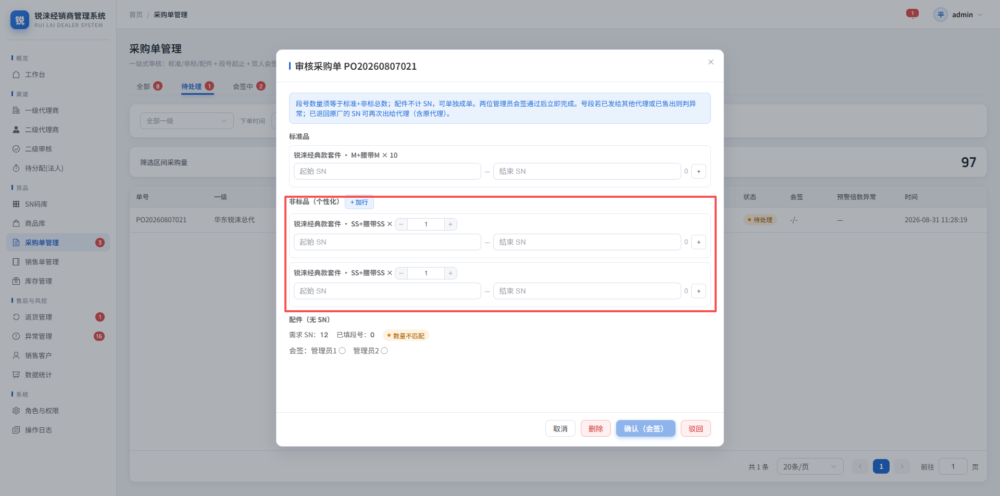

---

## 25. 采购单管理 — 已填写号段显示为10，但是无法确认保存，提示已填0

- 反馈日期：9月7日
- 平台：管理端
- 模块：采购单管理
- 状态：待处理
- 备注：无
- 表格行：26

**问题描述**

已填写号段显示为10，但是无法确认保存，提示已填0

**截图**

图1：

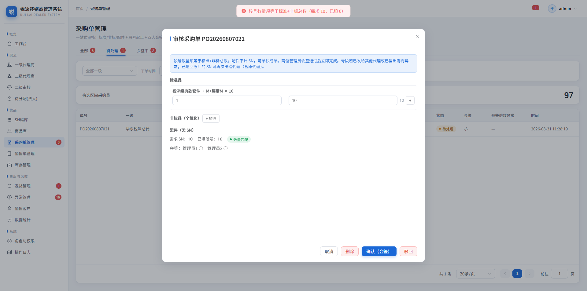

---

## 26. 采购单管理 — 已完成后面增加已驳回的状态标签切换

- 反馈日期：9月7日
- 平台：管理端
- 模块：采购单管理
- 状态：待处理
- 备注：无
- 表格行：27

**问题描述**

已完成后面增加已驳回的状态标签切换

**截图**

图1：

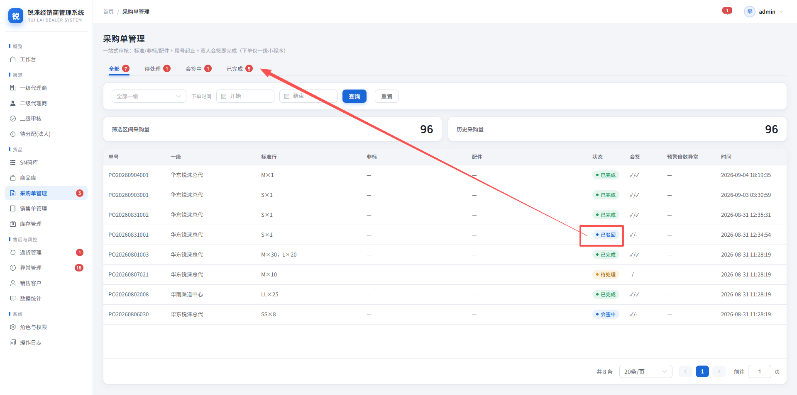

---

## 27. 采购单管理 — 当状态是已驳回，增加一个字段：驳回原因（就是驳回时候弹窗填写的内容）

- 反馈日期：9月7日
- 平台：管理端
- 模块：采购单管理
- 状态：待处理
- 备注：无
- 表格行：28

**问题描述**

当状态是已驳回，增加一个字段：驳回原因（就是驳回时候弹窗填写的内容）

**截图**

图1：

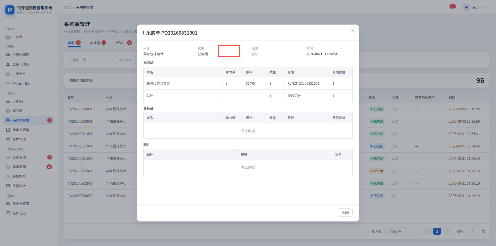

图2：

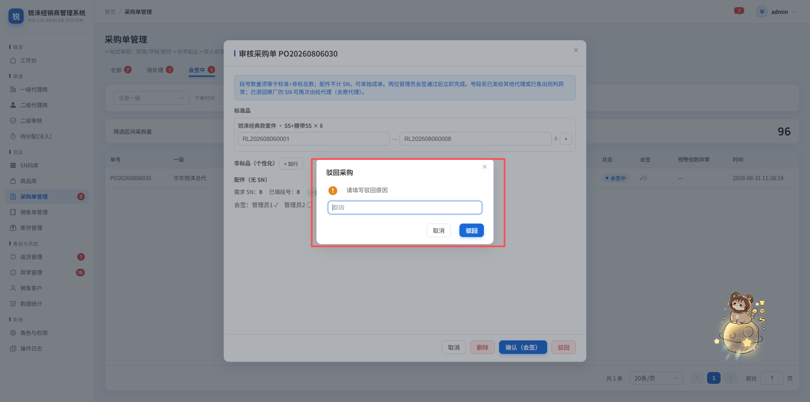

---

## 28. 销售单管理 — 标签上的数字去掉

- 反馈日期：9月7日
- 平台：管理端
- 模块：销售单管理
- 状态：待处理
- 备注：无
- 表格行：29

**问题描述**

标签上的数字去掉

**截图**

图1：

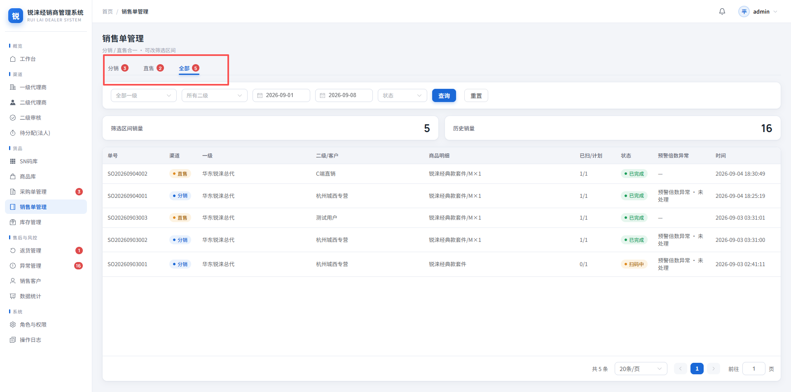

---

## 29. 销售单管理 — 时间筛选前面加文字下单时间

- 反馈日期：9月7日
- 平台：管理端
- 模块：销售单管理
- 状态：待处理
- 备注：无
- 表格行：30

**问题描述**

时间筛选前面加文字下单时间

**截图**

图1：

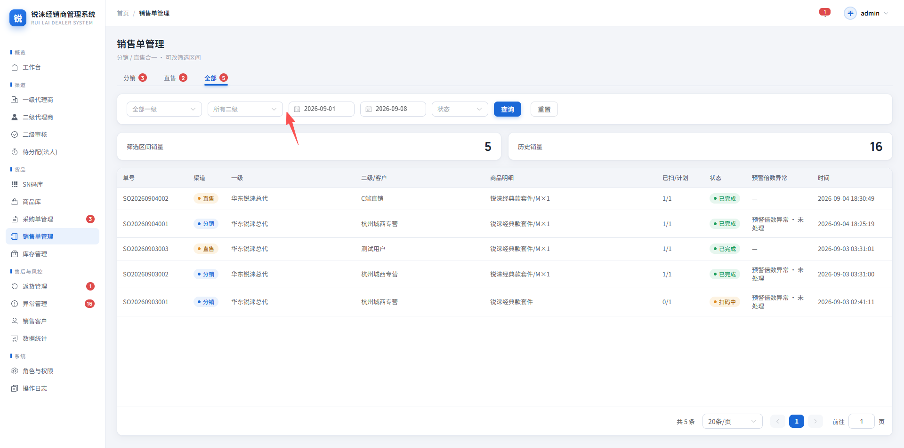

---

## 30. 销售单管理 — 详情下面大片空白去掉

- 反馈日期：9月7日
- 平台：管理端
- 模块：销售单管理
- 状态：待处理
- 备注：无
- 表格行：31

**问题描述**

详情下面大片空白去掉

**截图**

图1：

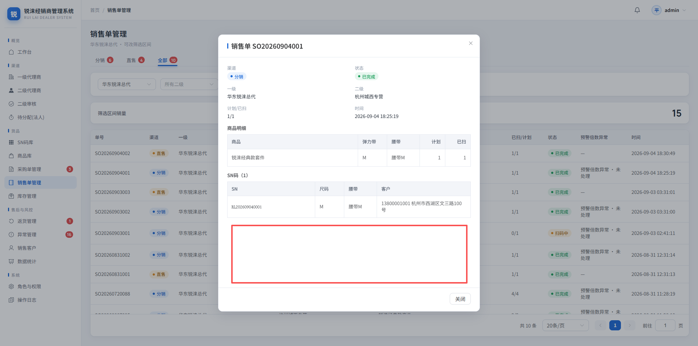

---

## 31. 库存管理 — 标签上的数字去掉

- 反馈日期：9月7日
- 平台：管理端
- 模块：库存管理
- 状态：待处理
- 备注：无
- 表格行：32

**问题描述**

标签上的数字去掉

**截图**

图1：

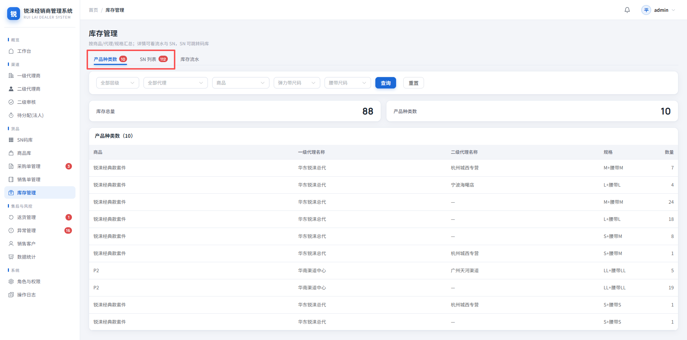

---

## 32. 库存管理 — 库存流水没有记录

- 反馈日期：9月7日
- 平台：管理端
- 模块：库存管理
- 状态：待处理
- 备注：无
- 表格行：33

**问题描述**

库存流水没有记录

**截图**

图1：

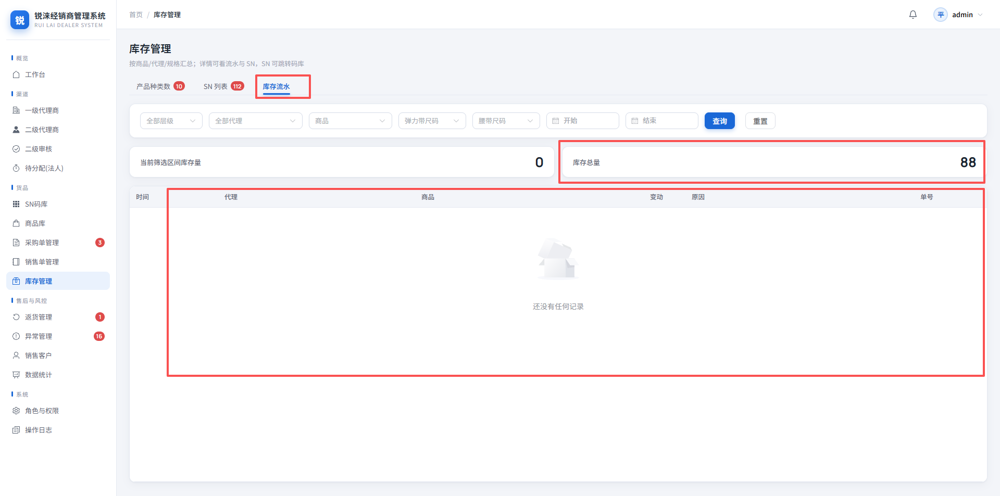

---

## 33. 返货管理 — 只有当一级代理退原厂有需要审核的时候，一级代理退原厂这里才会有上标数字，其他的标签的上标数字都去掉

- 反馈日期：9月7日
- 平台：管理端
- 模块：返货管理
- 状态：待处理
- 备注：无
- 表格行：34

**问题描述**

只有当一级代理退原厂有需要审核的时候，一级代理退原厂这里才会有上标数字，其他的标签的上标数字都去掉

**截图**

图1：

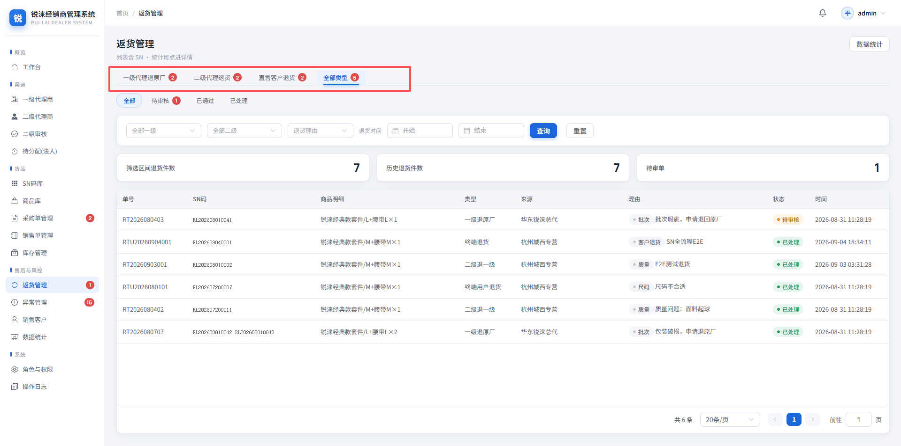

---

## 34. 返货管理 — 这2种描述是同一个类型，描述应该统一：终端退货

- 反馈日期：9月7日
- 平台：管理端
- 模块：返货管理
- 状态：待处理
- 备注：无
- 表格行：35

**问题描述**

这2种描述是同一个类型，描述应该统一：终端退货

**截图**

图1：

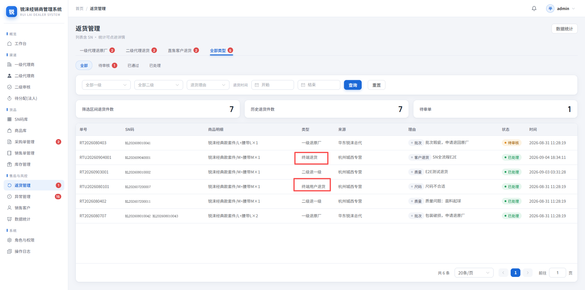

---

## 35. 返货管理 — 1、文字修改：处理改成驳回，审核通过改成通过

- 反馈日期：9月7日
- 平台：管理端
- 模块：返货管理
- 状态：待处理
- 备注：无
- 表格行：36

**问题描述**

1、文字修改：处理改成驳回，审核通过改成通过
2、点击审核通过或者驳回之后，需要加二次确认的弹窗

**截图**

图1：

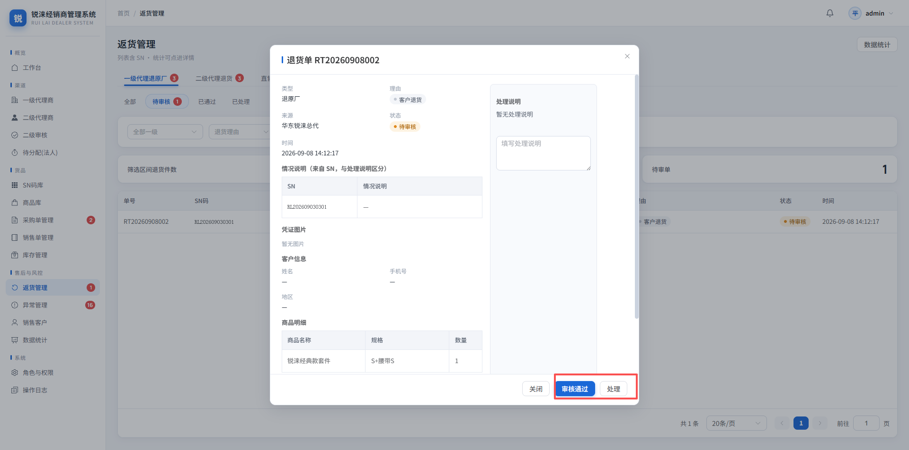

---

## 36. 返货管理 — 列表上的状态和标签切换的状态对不上，标签上已处理改成已驳回；列表上的已处理改成已通过

- 反馈日期：9月7日
- 平台：管理端
- 模块：返货管理
- 状态：待处理
- 备注：无
- 表格行：37

**问题描述**

列表上的状态和标签切换的状态对不上，标签上已处理改成已驳回；列表上的已处理改成已通过

**截图**

图1：

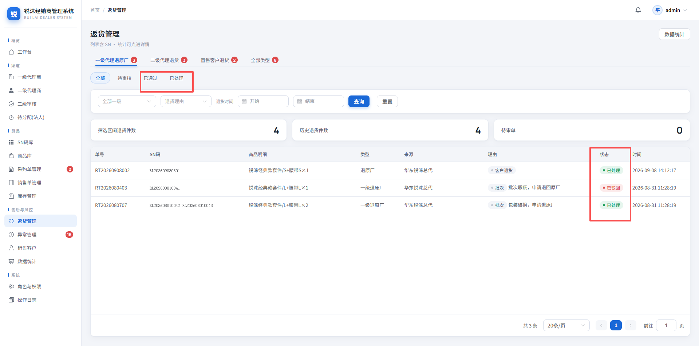

---

## 37. 返货管理/SN码库 — RL202608010041 该SN商品已发生售后，但SN码库里没有状态流转；且驳回时候填写的处理说明未在SN码库中同步显示；

- 反馈日期：9月7日
- 平台：管理端
- 模块：返货管理/SN码库
- 状态：待处理
- 备注：无
- 表格行：38

**问题描述**

RL202608010041 该SN商品已发生售后，但SN码库里没有状态流转；且驳回时候填写的处理说明未在SN码库中同步显示；
在SN码库中编辑的情况说明在返货管理里也没有同步显示；

**截图**

图1：

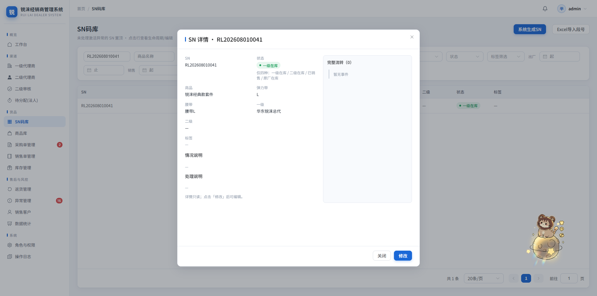

图2：

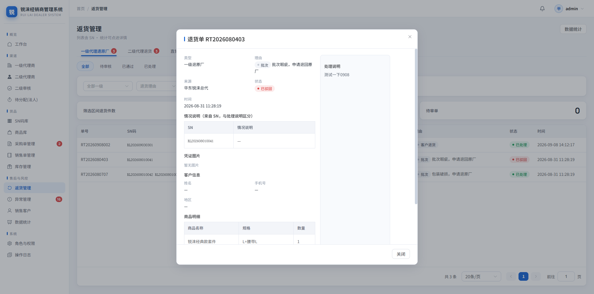

图3：

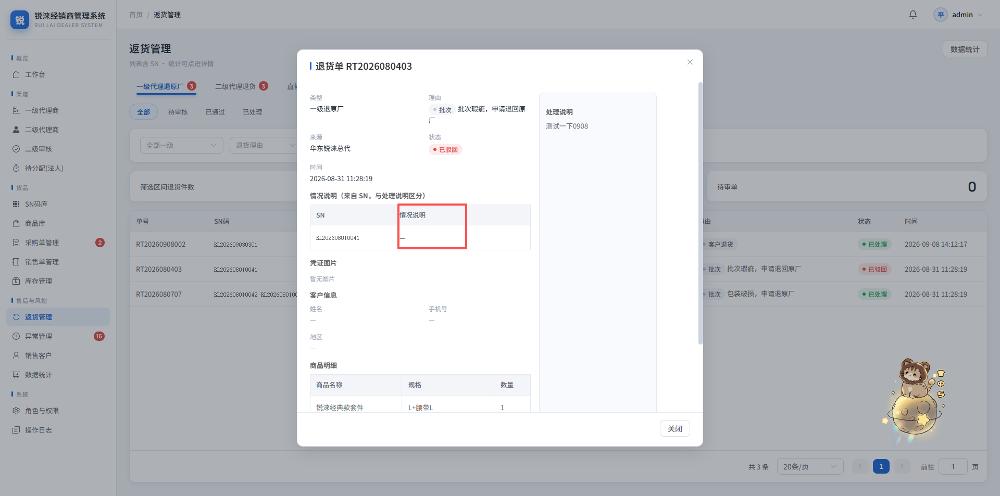

---

## 38. 异常管理 — 这是什么意思 有什么功能

- 反馈日期：9月7日
- 平台：管理端
- 模块：异常管理
- 状态：待处理
- 备注：无
- 表格行：39

**问题描述**

这是什么意思 有什么功能

**截图**

图1：

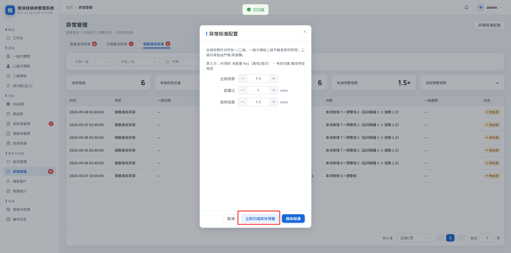

---

## 39. 异常管理 — 1、异常标准配置的超量比和周转倍数去掉

- 反馈日期：9月7日
- 平台：管理端
- 模块：异常管理
- 状态：待处理
- 备注：无
- 表格行：40

**问题描述**

1、异常标准配置的超量比和周转倍数去掉
2、下方大片空白去掉

**截图**

图1：

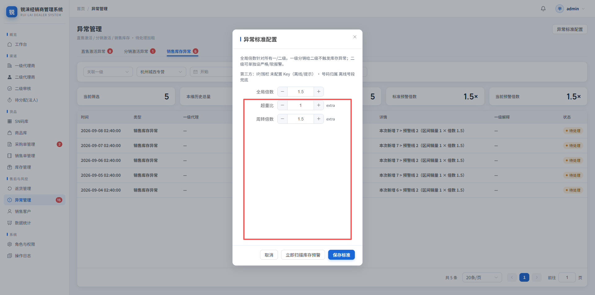

---

## 40. 异常管理 — 销售库存异常里的一级代理未显示

- 反馈日期：9月7日
- 平台：管理端
- 模块：异常管理
- 状态：待处理
- 备注：无
- 表格行：41

**问题描述**

销售库存异常里的一级代理未显示

**截图**

图1：

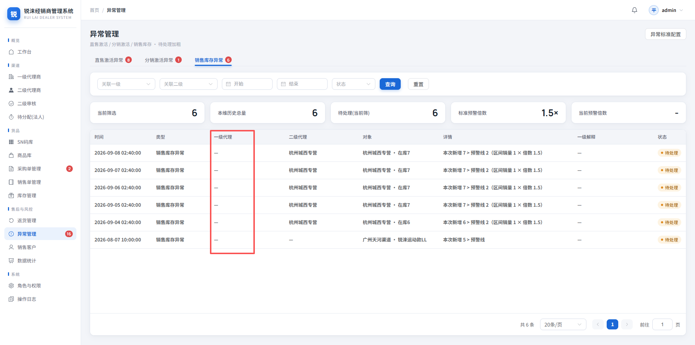

---

## 41. 异常管理 — 同一笔订单里两件商品不应该报重复异常

- 反馈日期：9月7日
- 平台：管理端
- 模块：异常管理
- 状态：待处理
- 备注：无
- 表格行：42

**问题描述**

同一笔订单里两件商品不应该报重复异常

**截图**

图1：

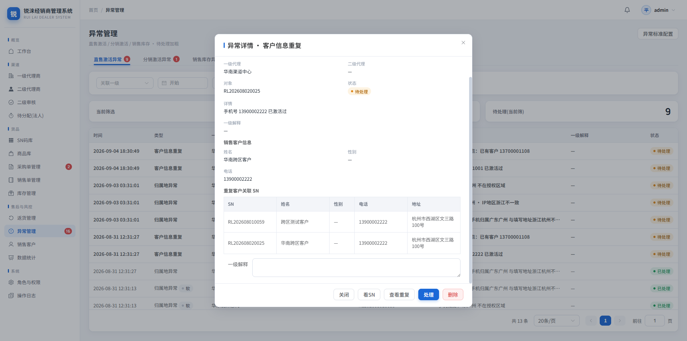

图2：

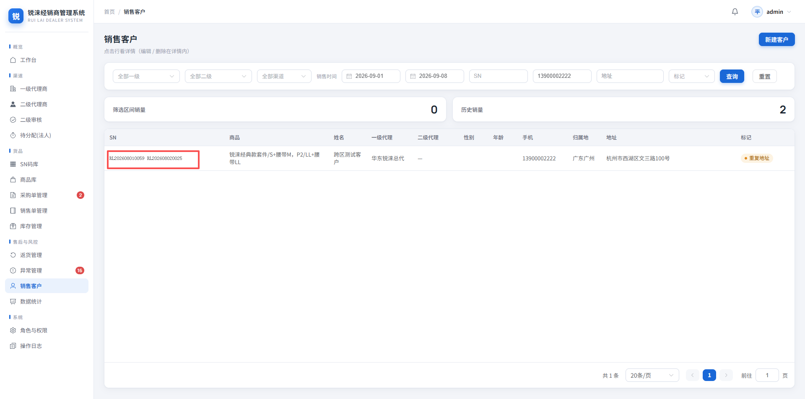

---

## 42. 异常管理 — 分销激活异常和直售激活异常的功能是一样的，区别在于直售激活异常是一级代理销售给C端用户时的激活异常，分销激活异常是指二级代理销售给C端用户时的激活异常。异常类型为：归属地异常、客户信息重复、IP异常

- 反馈日期：9月7日
- 平台：管理端
- 模块：异常管理
- 状态：待处理
- 备注：无
- 表格行：43

**问题描述**

分销激活异常和直售激活异常的功能是一样的，区别在于直售激活异常是一级代理销售给C端用户时的激活异常，分销激活异常是指二级代理销售给C端用户时的激活异常。异常类型为：归属地异常、客户信息重复、IP异常

---

## 43. 异常管理 — 时间筛选前面加文字报警时间

- 反馈日期：9月7日
- 平台：管理端
- 模块：异常管理
- 状态：待处理
- 备注：无
- 表格行：44

**问题描述**

时间筛选前面加文字报警时间

**截图**

图1：

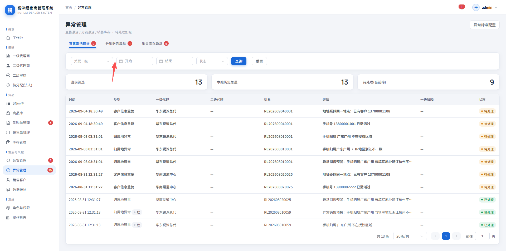

---

## 44. 异常管理 — 弹窗提示下面大片空白去掉

- 反馈日期：9月7日
- 平台：管理端
- 模块：异常管理
- 状态：待处理
- 备注：无
- 表格行：45

**问题描述**

弹窗提示下面大片空白去掉

**截图**

图1：

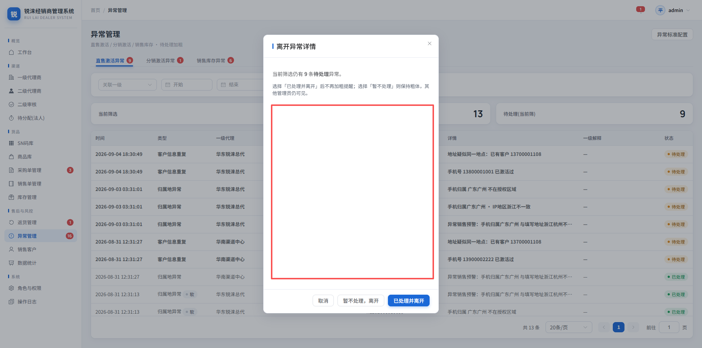

---

## 45. 销售客户 — 时间筛选未生效，只有第一条是9月的，其他都是8月的

- 反馈日期：9月7日
- 平台：管理端
- 模块：销售客户
- 状态：待处理
- 备注：无
- 表格行：46

**问题描述**

时间筛选未生效，只有第一条是9月的，其他都是8月的

**截图**

图1：

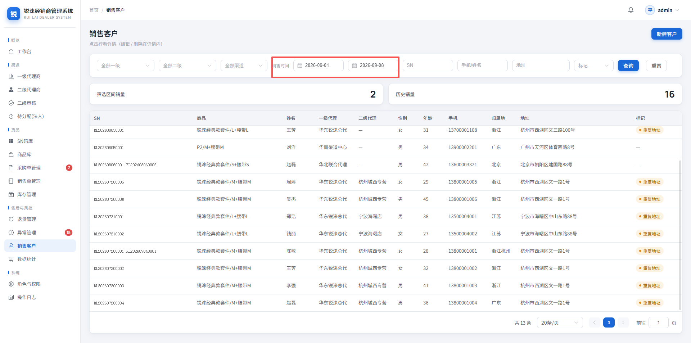

---

## 46. 销售客户 — 1、筛选的标记下拉框应该是重复地址、重复手机号，去掉仅重复

- 反馈日期：9月7日
- 平台：管理端
- 模块：销售客户
- 状态：待处理
- 备注：无
- 表格行：47

**问题描述**

1、筛选的标记下拉框应该是重复地址、重复手机号，去掉仅重复
2、因为小程序上无法输入地址，暂时无法验证当手机号也重复时会怎么提示。需要系统自己验证下，正确效果是同时显示重复手机号和重复地址两个标签并列

**截图**

图1：

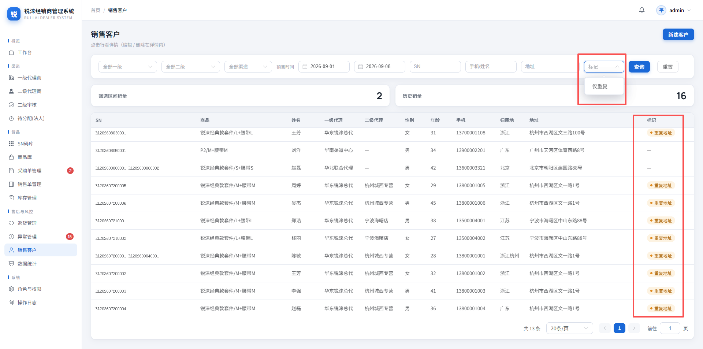

---

## 47. 数据统计 — 1、区间激活数换行放到累计激活数前面

- 反馈日期：9月7日
- 平台：管理端
- 模块：数据统计
- 状态：待处理
- 备注：无
- 表格行：48

**问题描述**

1、区间激活数换行放到累计激活数前面
2、每个卡片宽度调整，平铺满

**截图**

图1：

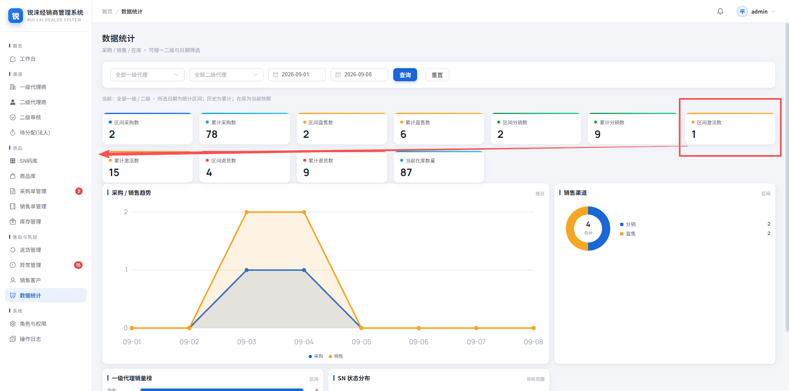

---

## 48. 数据统计 — 二级代理应该不存在直售数，直售是指一级代理直接销售给C端用户

- 反馈日期：9月7日
- 平台：管理端
- 模块：数据统计
- 状态：待处理
- 备注：无
- 表格行：49

**问题描述**

二级代理应该不存在直售数，直售是指一级代理直接销售给C端用户

**截图**

图1：

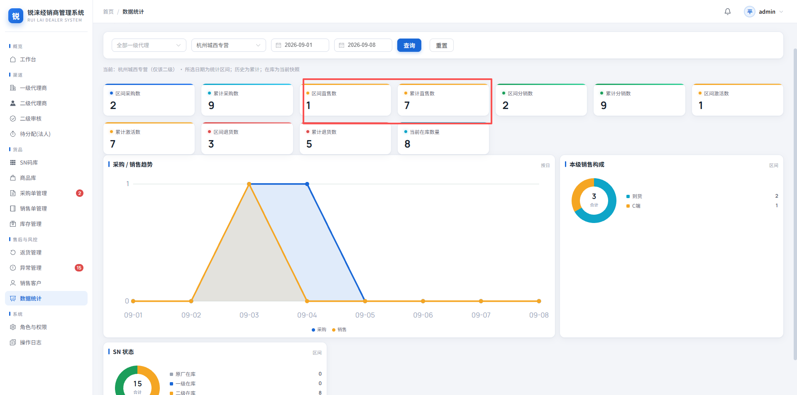

---

## 49. 数据统计 — 1、本级销售构成改成销售渠道

- 反馈日期：9月7日
- 平台：管理端
- 模块：数据统计
- 状态：待处理
- 备注：无
- 表格行：50

**问题描述**

1、本级销售构成改成销售渠道
2、缺少一级代理排行
3、累计激活数这一排的卡片和下面的图表中间缺少间隔
4、下面图表布局调整成和设计稿一样

**截图**

图1：

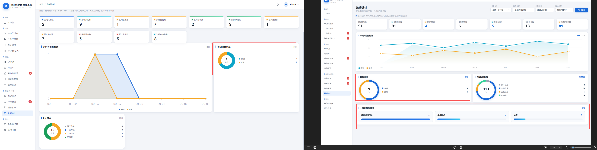

---

## 50. 角色与权限 — 创建角色时选的这些是什么意思，没看懂

- 反馈日期：9月7日
- 平台：管理端
- 模块：角色与权限
- 状态：待处理
- 备注：无
- 表格行：51

**问题描述**

创建角色时选的这些是什么意思，没看懂

**截图**

图1：

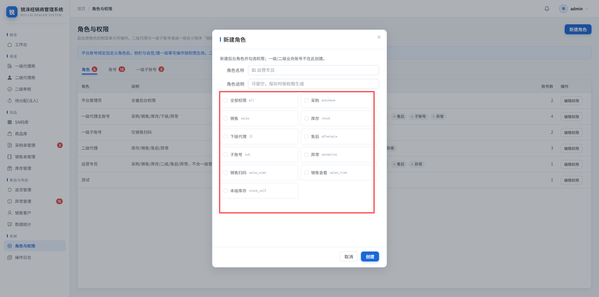

---

## 51. 角色与权限 — 角色操作这里增加删除按钮，可以删除没有绑定过账号的角色

- 反馈日期：9月7日
- 平台：管理端
- 模块：角色与权限
- 状态：待处理
- 备注：无
- 表格行：52

**问题描述**

角色操作这里增加删除按钮，可以删除没有绑定过账号的角色

**截图**

图1：

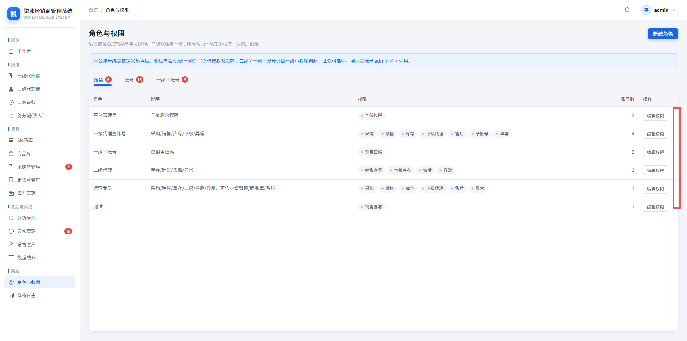

---

## 52. 角色与权限 — 账号要可以修改密码

- 反馈日期：9月7日
- 平台：管理端
- 模块：角色与权限
- 状态：待处理
- 备注：无
- 表格行：53

**问题描述**

账号要可以修改密码

**截图**

图1：

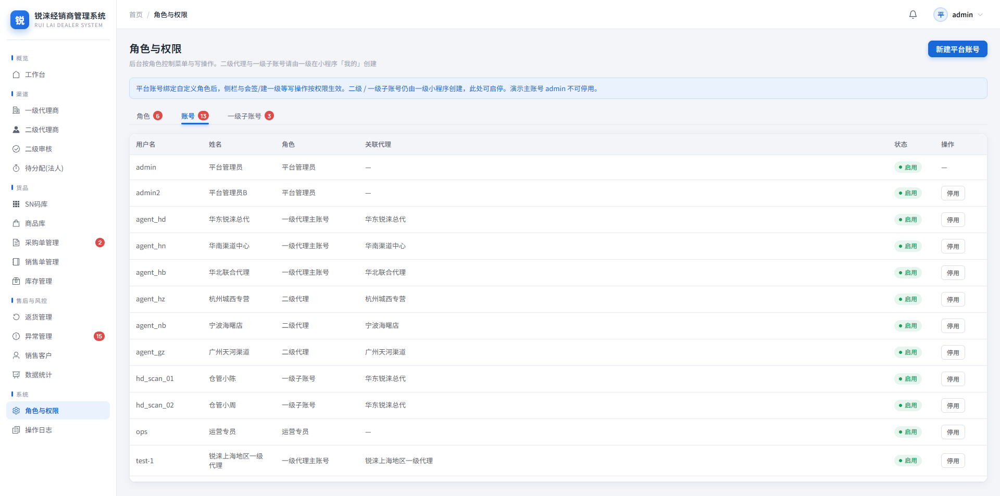

---

## 53. 通知 — 点击之后跳转至列表页

- 反馈日期：9月7日
- 平台：管理端
- 模块：通知
- 状态：待处理
- 备注：无
- 表格行：54

**问题描述**

点击之后跳转至列表页

**截图**

图1：

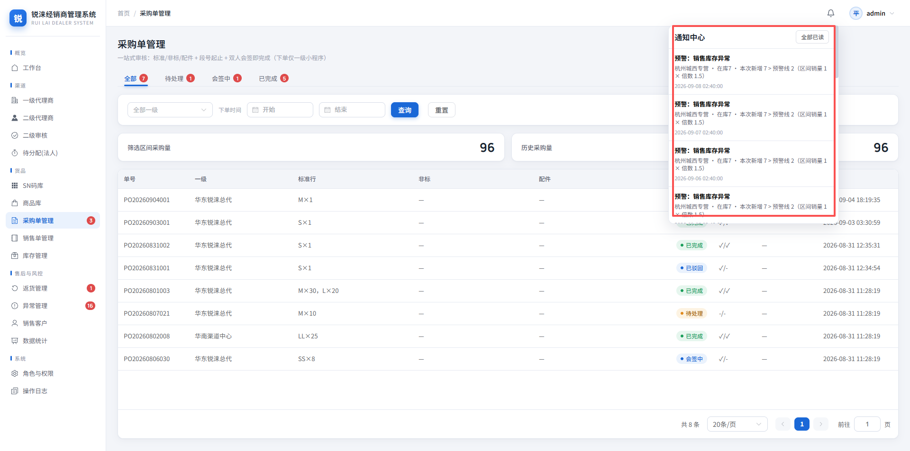

---

## 54. 数据 — 1、日期选择区域样式调整成设计稿那样

- 反馈日期：9月7日
- 平台：小程序
- 模块：数据
- 状态：待处理
- 备注：无
- 表格行：55

**问题描述**

1、日期选择区域样式调整成设计稿那样
2、当前在库数放到图表上方
3、下面图表数据用左右切换的，移动端可以左右滑动交互效果

**截图**

图1：

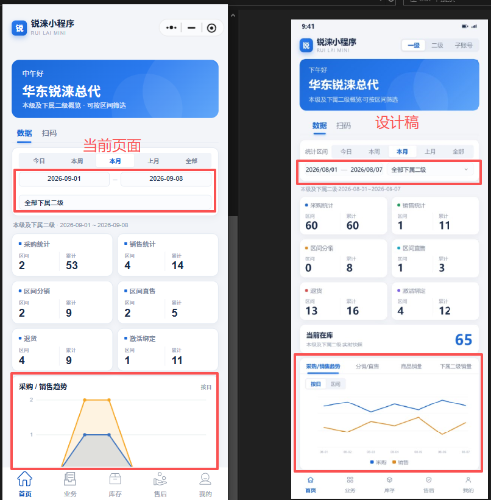

---

## 55. 数据 — 在手机上图表遮挡了菜单

- 反馈日期：9月7日
- 平台：小程序
- 模块：数据
- 状态：待处理
- 备注：无
- 表格行：56

**问题描述**

在手机上图表遮挡了菜单

**截图**

图1：

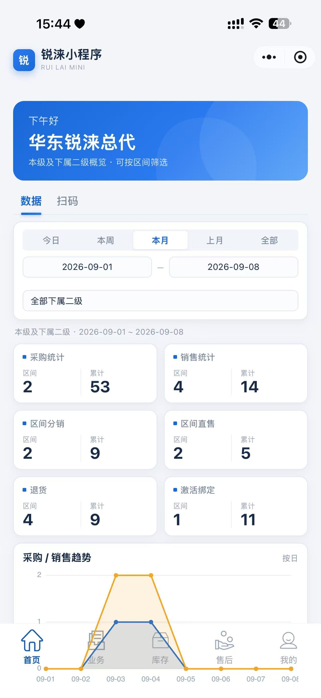

---

## 56. 扫码 — 1、去掉查询扫码

- 反馈日期：9月7日
- 平台：小程序
- 模块：扫码
- 状态：待处理
- 备注：无
- 表格行：57

**问题描述**

1、去掉查询扫码
2、卡片调整到合适宽度
3、按钮上下间隙调大一点
4、下方待扫描的缺少商品名称、进度

**截图**

图1：

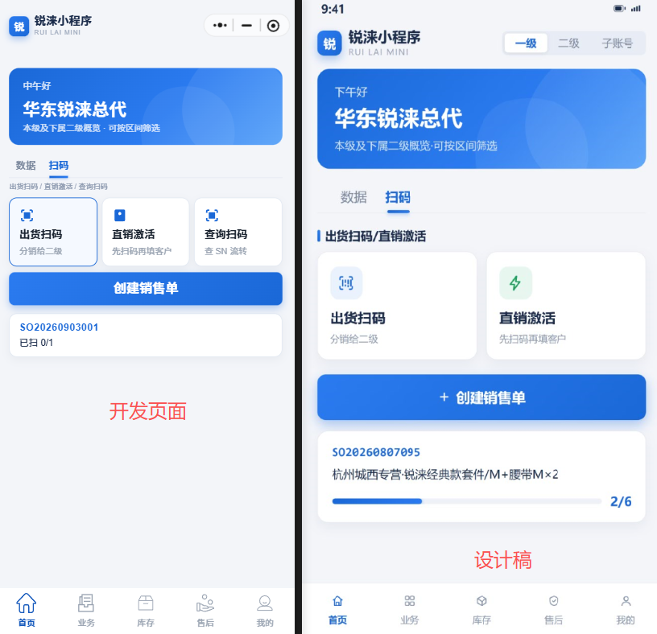

---

## 57. 扫码 — 1、缺少输入sn码的框

- 反馈日期：9月7日
- 平台：小程序
- 模块：扫码
- 状态：待处理
- 备注：无
- 表格行：58

**问题描述**

1、缺少输入sn码的框
2、缺少下一步填写客户信息

**截图**

图1：

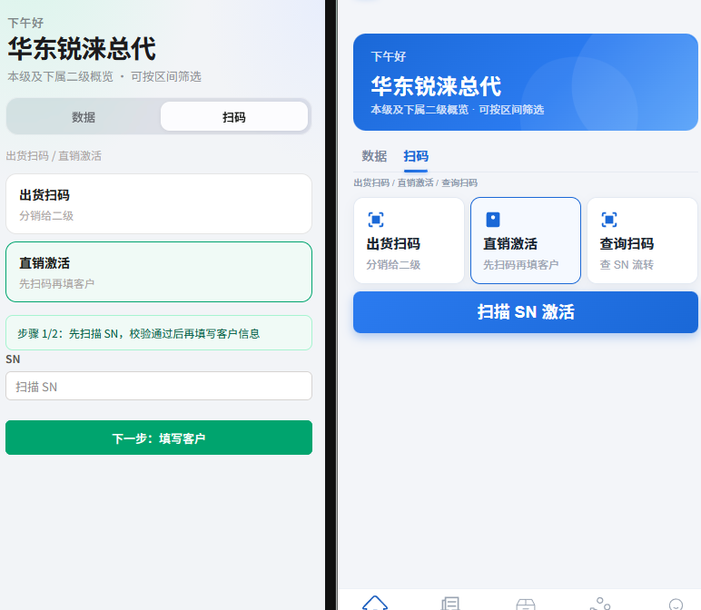

---

## 58. 扫码 — 应该可以一单扫码/输入多个SN码

- 反馈日期：9月7日
- 平台：小程序
- 模块：扫码
- 状态：待处理
- 备注：无
- 表格行：59

**问题描述**

应该可以一单扫码/输入多个SN码

**截图**

图1：

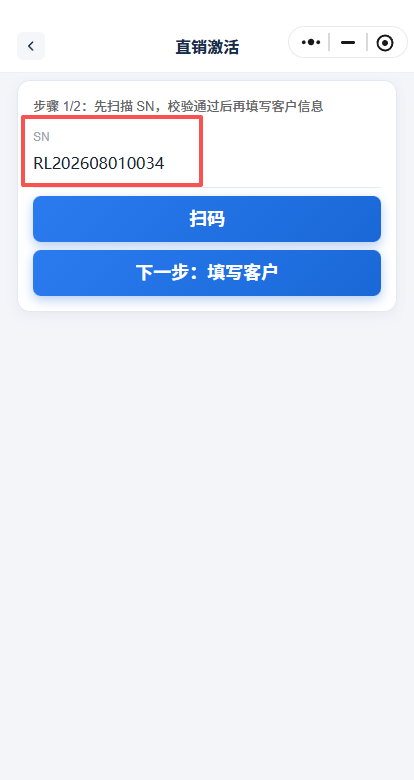

---

## 59. 扫码 — 输入不进去，填写没反应

- 反馈日期：9月7日
- 平台：小程序
- 模块：扫码
- 状态：待处理
- 备注：无
- 表格行：60

**问题描述**

输入不进去，填写没反应

**截图**

图1：

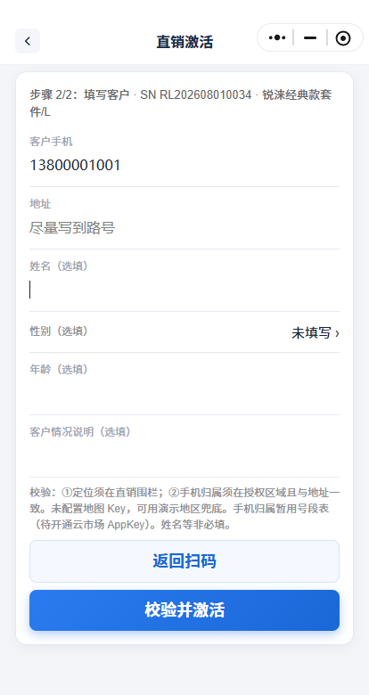

---

## 60. 扫码 — 地址的样式改成  [省 ▼] [市 ▼] [区 ▼]    [____路] [____号/弄] [____室]

- 反馈日期：9月7日
- 平台：小程序
- 模块：扫码
- 状态：待处理
- 备注：无
- 表格行：61

**问题描述**

地址的样式改成  [省 ▼] [市 ▼] [区 ▼]    [____路] [____号/弄] [____室]
，省市区是下拉框且联动的，路号室是输入框

**截图**

图1：

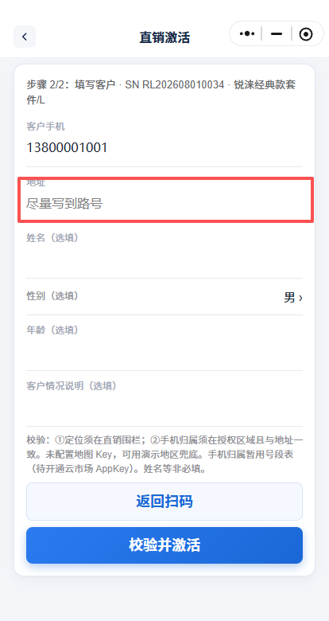

---

## 61. 业务-采购 — 1、标签上只显示待处理和会签中的数字，已完成和全部的不需要显示上标

- 反馈日期：9月7日
- 平台：小程序
- 模块：业务-采购
- 状态：待处理
- 备注：无
- 表格行：62

**问题描述**

1、标签上只显示待处理和会签中的数字，已完成和全部的不需要显示上标
2、已完成后面增加标签已驳回
3、列表上缺少号段

**截图**

图1：

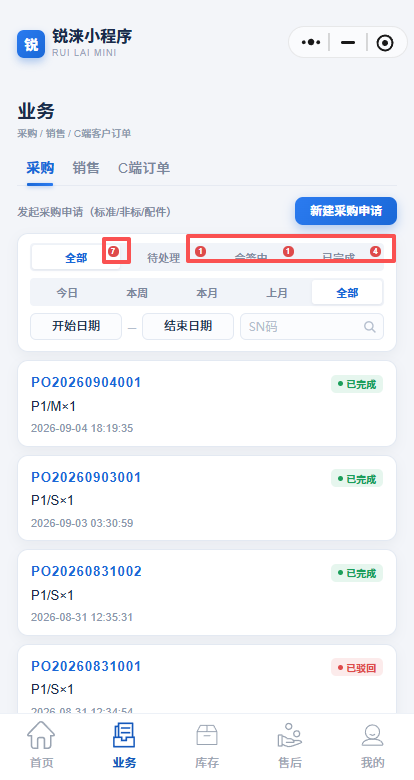

图2：

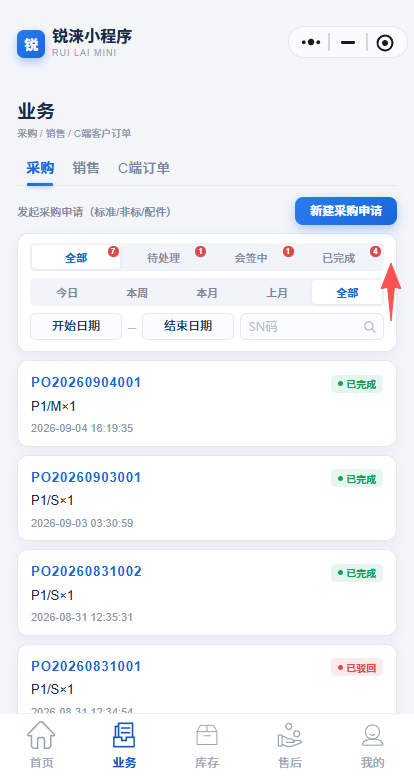

图3：

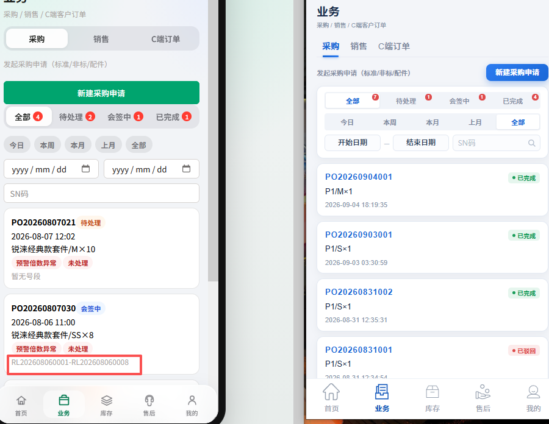

---

## 62. 业务-采购 — 1、详情信息和原型不匹配

- 反馈日期：9月7日
- 平台：小程序
- 模块：业务-采购
- 状态：待处理
- 备注：无
- 表格行：63

**问题描述**

1、详情信息和原型不匹配
2、号段不要有代码

**截图**

图1：

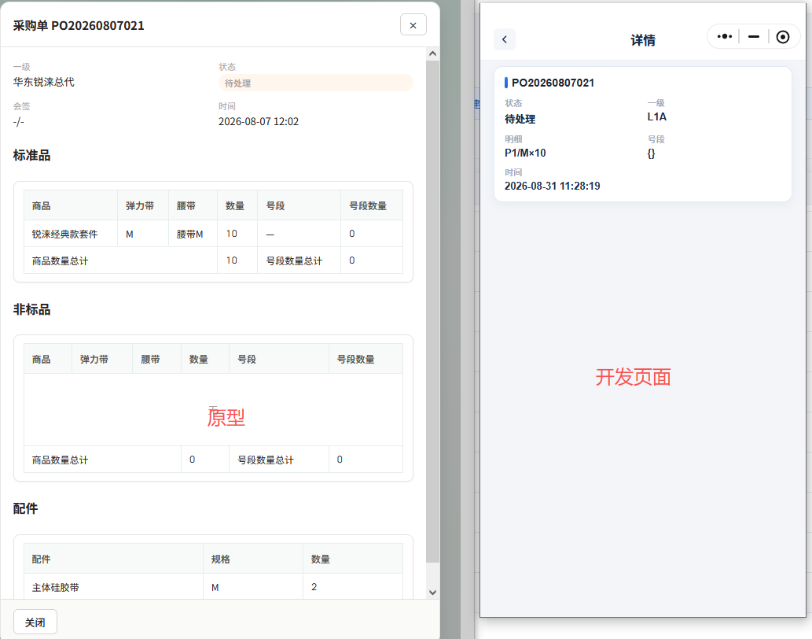

图2：

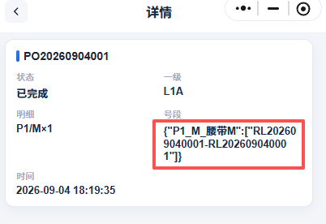

---

## 63. 业务-采购 — 创建采购单页面重新做

- 反馈日期：9月7日
- 平台：小程序
- 模块：业务-采购
- 状态：待处理
- 备注：无
- 表格行：64

**问题描述**

创建采购单页面重新做

**截图**

图1：

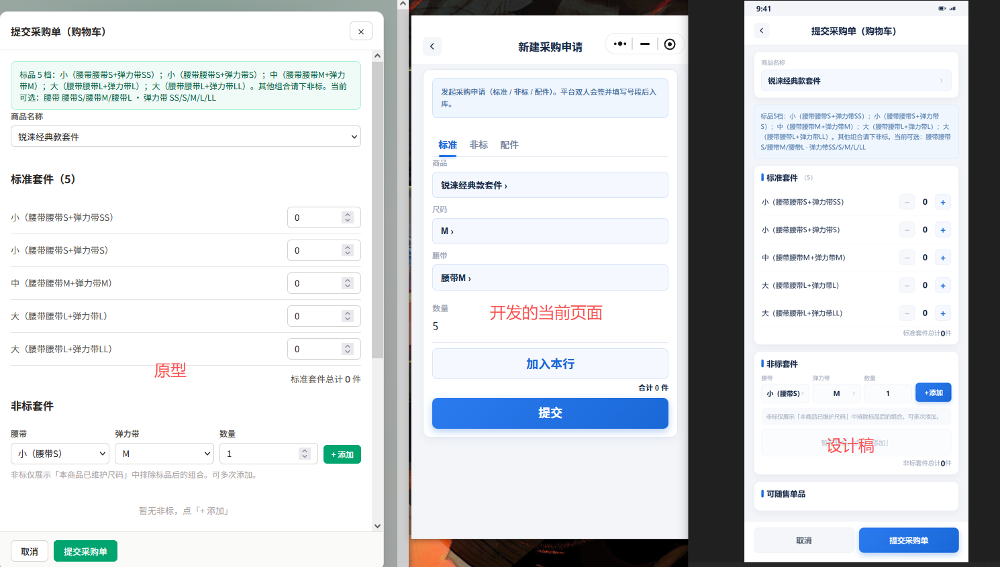

---

## 64. 业务-销售 — 缺少号段

- 反馈日期：9月7日
- 平台：小程序
- 模块：业务-销售
- 状态：待处理
- 备注：无
- 表格行：65

**问题描述**

缺少号段

**截图**

图1：

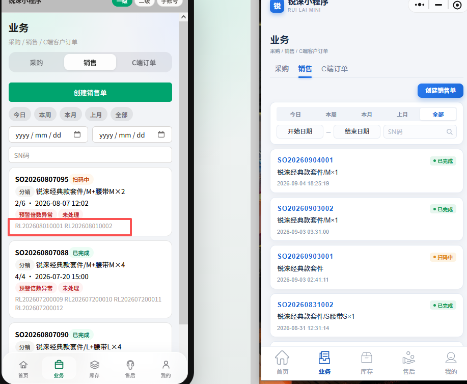

---

## 65. 业务-销售 — 详情信息和原型不匹配

- 反馈日期：9月7日
- 平台：小程序
- 模块：业务-销售
- 状态：待处理
- 备注：无
- 表格行：66

**问题描述**

详情信息和原型不匹配

**截图**

图1：

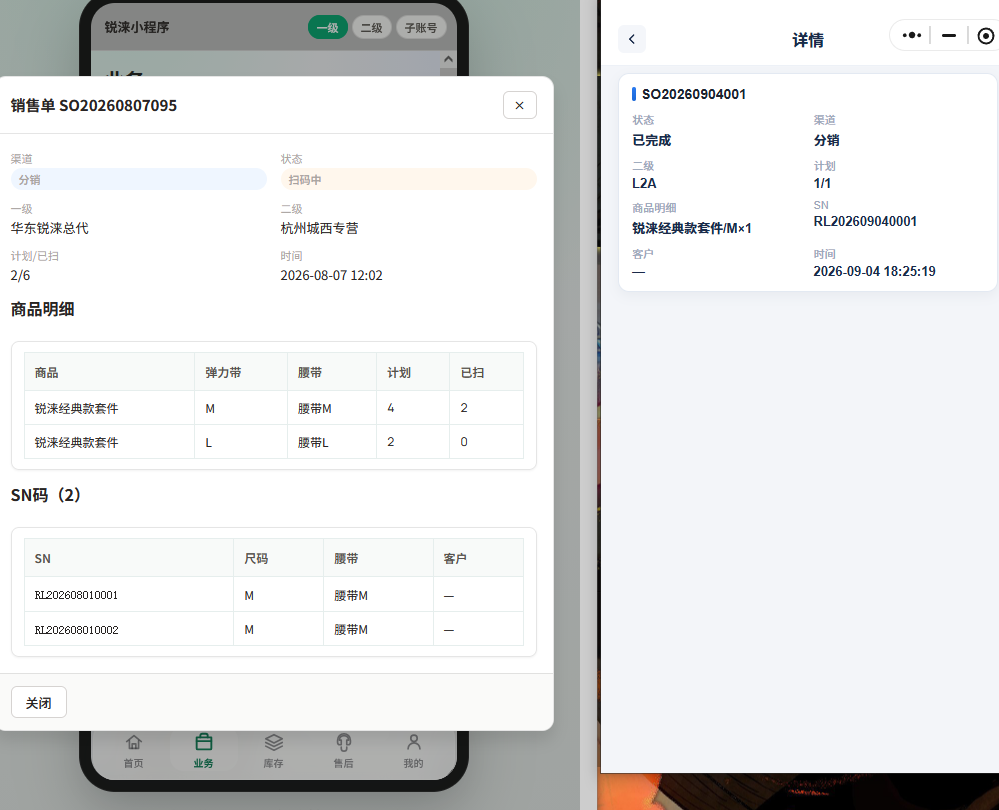

---

## 66. 业务-销售 — 创建销售单页面重新做

- 反馈日期：9月7日
- 平台：小程序
- 模块：业务-销售
- 状态：待处理
- 备注：无
- 表格行：67

**问题描述**

创建销售单页面重新做

**截图**

图1：

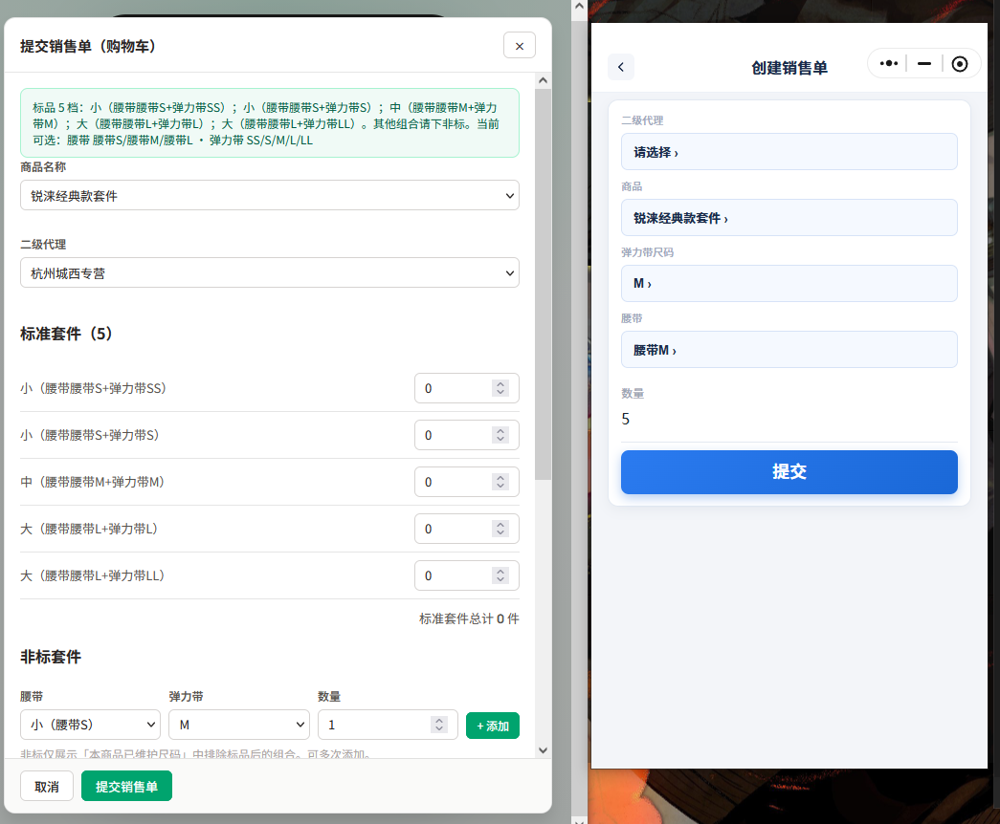

---

## 67. 业务-C端订单 — 详情信息和原型不匹配

- 反馈日期：9月7日
- 平台：小程序
- 模块：业务-C端订单
- 状态：待处理
- 备注：无
- 表格行：68

**问题描述**

详情信息和原型不匹配

**截图**

图1：

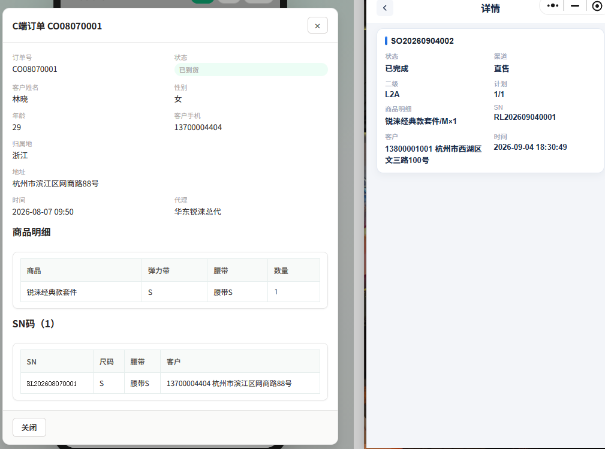

---

## 68. 库存 — 去掉标签上的数字

- 反馈日期：9月7日
- 平台：小程序
- 模块：库存
- 状态：待处理
- 备注：无
- 表格行：69

**问题描述**

去掉标签上的数字

**截图**

图1：

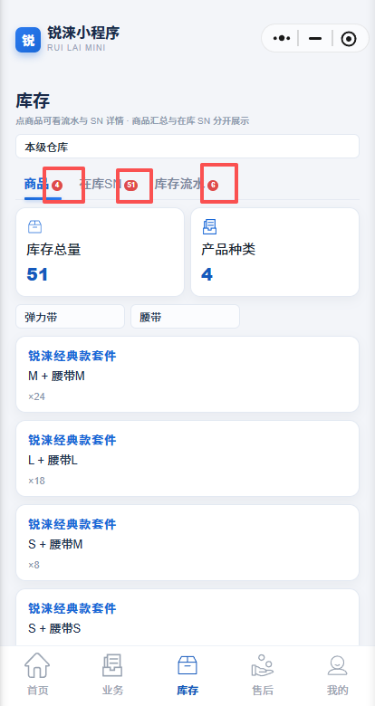

---

## 69. 库存-在库SN — 详情信息和原型不匹配

- 反馈日期：9月7日
- 平台：小程序
- 模块：库存-在库SN
- 状态：待处理
- 备注：无
- 表格行：70

**问题描述**

详情信息和原型不匹配
流转样式和PC的流转样式保持统一

**截图**

图1：

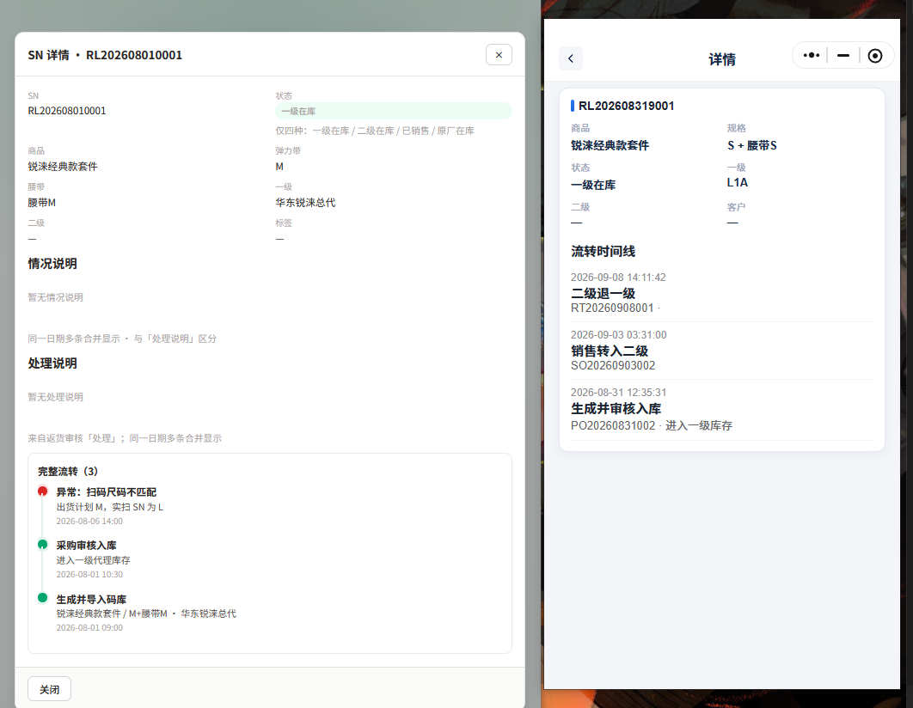

图2：

---

## 70. 库存-商品 — 当前开发的页面点击详情后直接跳转到在库SN列表页了，缺少详情页

- 反馈日期：9月7日
- 平台：小程序
- 模块：库存-商品
- 状态：待处理
- 备注：无
- 表格行：71

**问题描述**

当前开发的页面点击详情后直接跳转到在库SN列表页了，缺少详情页

**截图**

图1：

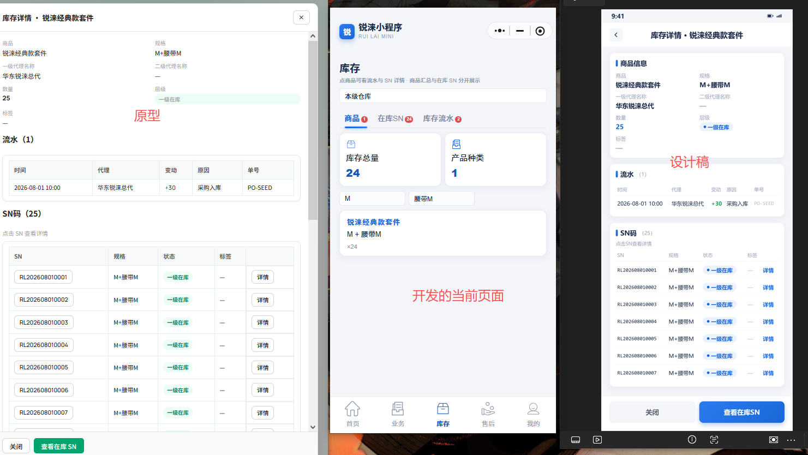

---

## 71. 售后 — 1、详情信息和原型不匹配

- 反馈日期：9月7日
- 平台：小程序
- 模块：售后
- 状态：待处理
- 备注：无
- 表格行：72

**问题描述**

1、详情信息和原型不匹配
2、样式调整成设计稿那样

**截图**

图1：

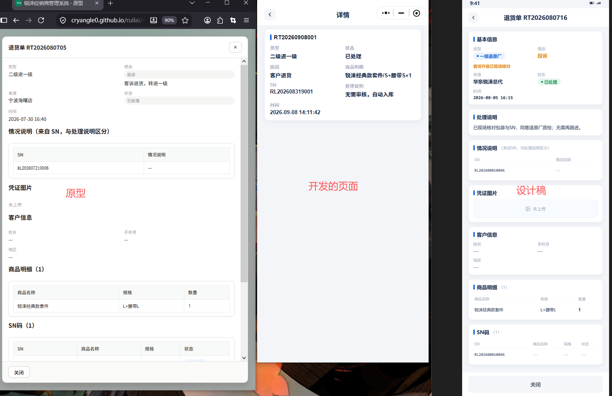

---

## 72. 售后 — 列表上标签没有加样式

- 反馈日期：9月7日
- 平台：小程序
- 模块：售后
- 状态：待处理
- 备注：无
- 表格行：73

**问题描述**

列表上标签没有加样式

**截图**

图1：

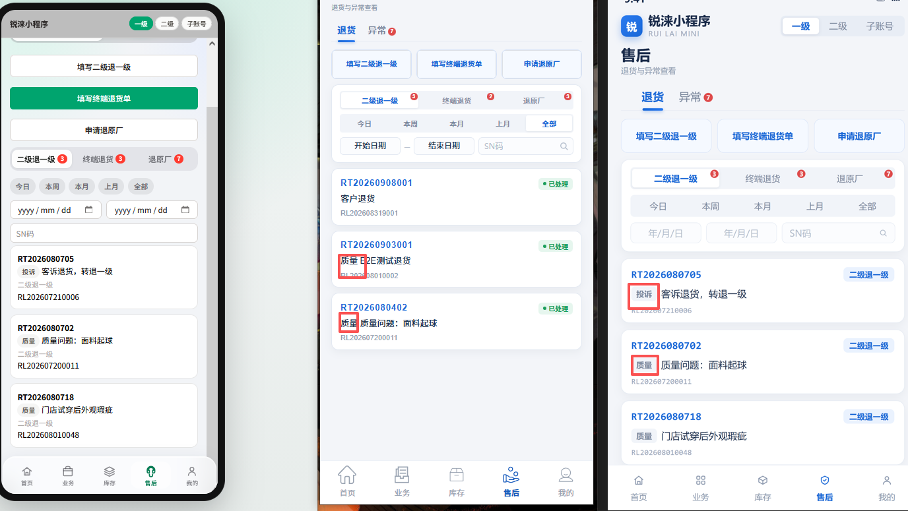

---

## 73. 售后 — 去掉标签上的数字，仅显示待处理的数字

- 反馈日期：9月7日
- 平台：小程序
- 模块：售后
- 状态：待处理
- 备注：无
- 表格行：74

**问题描述**

去掉标签上的数字，仅显示待处理的数字

**截图**

图1：

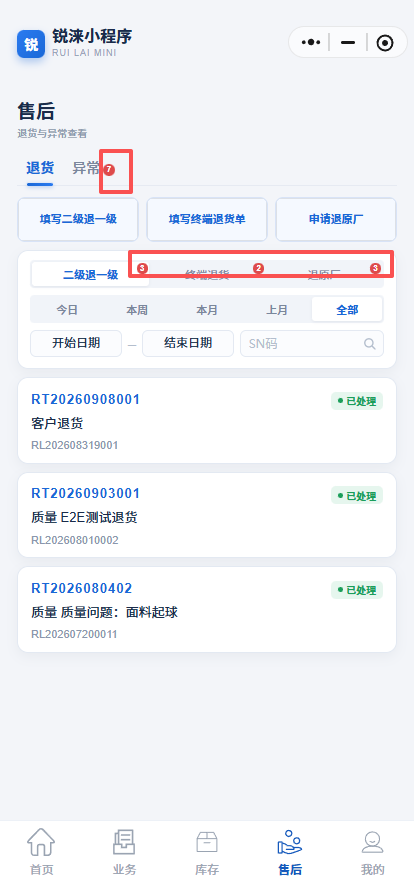

---

## 74. 售后 — 输入不进去，填写没反应

- 反馈日期：9月7日
- 平台：小程序
- 模块：售后
- 状态：待处理
- 备注：无
- 表格行：75

**问题描述**

输入不进去，填写没反应

**截图**

图1：

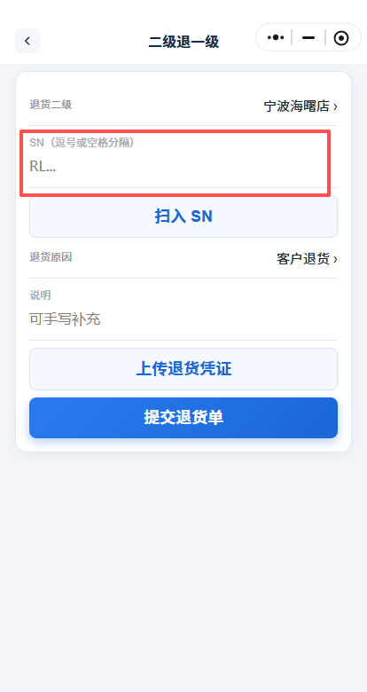

---

## 75. 售后 — 填写二级退一级/填写终端退货单/申请退原厂的SN都只能填一个，应该要可以填写多个或者扫描多个

- 反馈日期：9月7日
- 平台：小程序
- 模块：售后
- 状态：待处理
- 备注：无
- 表格行：76

**问题描述**

填写二级退一级/填写终端退货单/申请退原厂的SN都只能填一个，应该要可以填写多个或者扫描多个

**截图**

图1：

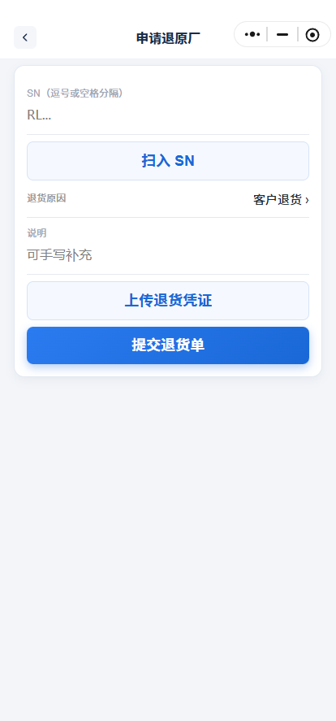

---

## 76. 售后 — 列表上的状态和标签切换的状态对不上，标签上已处理改成已驳回；列表上的已处理改成已通过

- 反馈日期：9月7日
- 平台：小程序
- 模块：售后
- 状态：待处理
- 备注：无
- 表格行：77

**问题描述**

列表上的状态和标签切换的状态对不上，标签上已处理改成已驳回；列表上的已处理改成已通过

**截图**

图1：

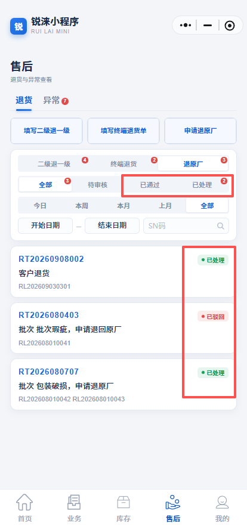

---

## 77. 售后 — 去掉标签上的数字，仅显示待审核的数字

- 反馈日期：9月7日
- 平台：小程序
- 模块：售后
- 状态：待处理
- 备注：无
- 表格行：78

**问题描述**

去掉标签上的数字，仅显示待审核的数字

**截图**

图1：

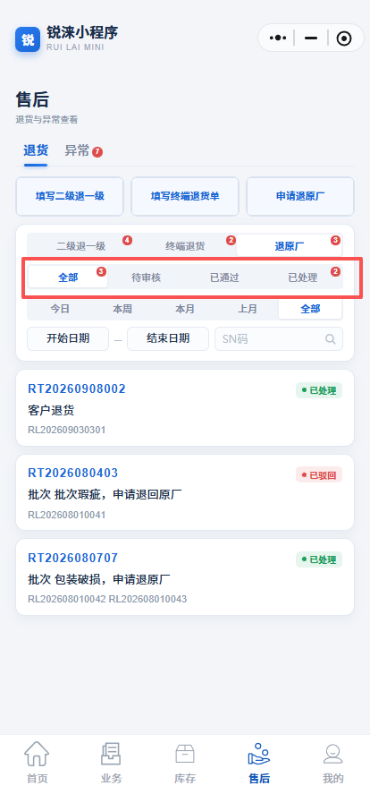

---

## 78. 异常 — 缺少客户信息

- 反馈日期：9月7日
- 平台：小程序
- 模块：异常
- 状态：待处理
- 备注：无
- 表格行：79

**问题描述**

缺少客户信息

**截图**

图1：

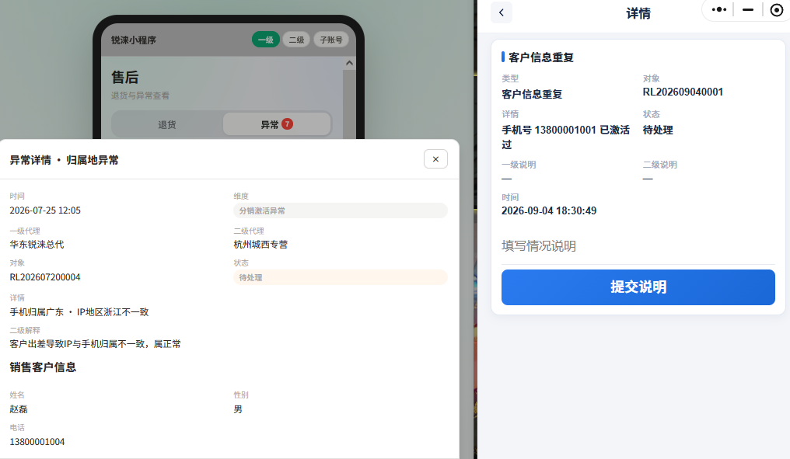

---

## 79. 异常 — 分销激活异常和直售激活异常的功能是一样的，区别在于直售激活异常是一级代理销售给C端用户时的激活异常，分销激活异常是指二级代理销售给C端用户时的激活异常。异常类型为：归属地异常、客户信息重复、IP异常

- 反馈日期：9月7日
- 平台：小程序
- 模块：异常
- 状态：待处理
- 备注：无
- 表格行：80

**问题描述**

分销激活异常和直售激活异常的功能是一样的，区别在于直售激活异常是一级代理销售给C端用户时的激活异常，分销激活异常是指二级代理销售给C端用户时的激活异常。异常类型为：归属地异常、客户信息重复、IP异常

**截图**

图1：

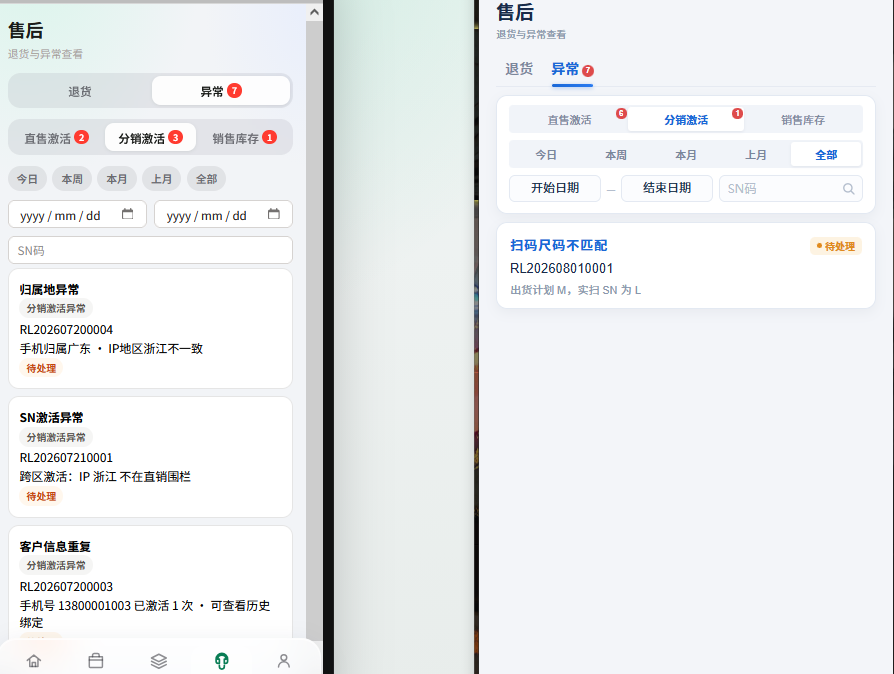

---

## 80. 异常 — 筛选项增加二级代理下拉框

- 反馈日期：9月7日
- 平台：小程序
- 模块：异常
- 状态：待处理
- 备注：无
- 表格行：81

**问题描述**

筛选项增加二级代理下拉框

**截图**

图1：

---

## 81. 异常 — PC有数据，但小程序上未显示

- 反馈日期：9月7日
- 平台：小程序
- 模块：异常
- 状态：待处理
- 备注：无
- 表格行：82

**问题描述**

PC有数据，但小程序上未显示

**截图**

图1：

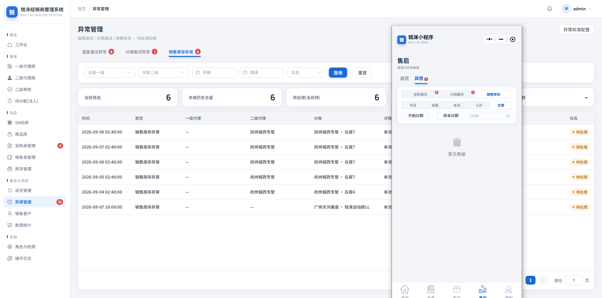
